# SMS Expense Tracker — Solution Design Document

> **Version:** 2.0  
> **Date:** July 2026  
> **Status:** Draft  
> **Author:** Solution Architect

---

## Table of Contents

1. [Executive Summary](#1-executive-summary)
2. [Project Goals & Constraints](#2-project-goals--constraints)
3. [High-Level Architecture](#3-high-level-architecture)
4. [Technology Stack](#4-technology-stack)
5. [System Architecture (Detailed)](#5-system-architecture-detailed)
6. [Database Design (ER Diagram)](#6-database-design-er-diagram)
7. [SMS Parsing Pipeline](#7-sms-parsing-pipeline)
8. [Indian Bank SMS Patterns](#8-indian-bank-sms-patterns)
9. [User-Extensible Regex System](#9-user-extensible-regex-system)
10. [UI/UX Architecture](#10-uiux-architecture)
11. [Onboarding & SMS Sync Flow](#11-onboarding--sms-sync-flow)
12. [Sequence Diagrams](#12-sequence-diagrams)
13. [Data Flow Diagrams](#13-data-flow-diagrams)
14. [Error Logging Strategy](#14-error-logging-strategy)
15. [Testing Strategy](#15-testing-strategy)
16. [Play Store Considerations](#16-play-store-considerations)
17. [CI/CD Pipeline (GitHub Actions)](#17-cicd-pipeline-github-actions)
18. [ProGuard/R8 Rules](#18-proguardr8-rules)
19. [Room TypeConverters & Migrations](#19-room-typeconverters--migrations)
20. [Pre-populated Data (Banks & Categories)](#20-pre-populated-data-banks--categories)
21. [Coroutine & Dispatcher Strategy](#21-coroutine--dispatcher-strategy)
22. [Debounce & Batching Strategy](#22-debounce--batching-strategy)
23. [Hilt Module Structure](#23-hilt-module-structure)
24. [Empty States](#24-empty-states)
25. [Manual Transaction Entry](#25-manual-transaction-entry)
26. [Error States in UI](#26-error-states-in-ui)
27. [Risk Mitigation](#27-risk-mitigation)
28. [Future Enhancements](#28-future-enhancements)

---

## 1. Executive Summary

**SMS Expense Tracker** is an offline-first Android application that reads bank transaction SMS messages from the user's device, parses them to extract structured financial data (amount, type, merchant, balance, etc.), and presents insights through interactive dashboards and charts.

### Key Differentiators

- **100% Offline**: No internet required. All parsing and data storage happen on-device.
- **Privacy-First**: Raw SMS data never leaves the device. Only parsed metadata is stored locally.
- **Indian Bank Focused**: Pre-configured regex patterns for 15+ major Indian banks with user-extensible rules.
- **Modern Material 3 Expressive**: Beautiful, fast, Compose-native UI with Vico charts.
- **Transparent Parsing**: Users can view, test, and edit every regex rule used by the app.

---

## 2. Project Goals & Constraints

### 2.1 Functional Goals

| ID  | Goal                                                                                                | Priority |
| --- | --------------------------------------------------------------------------------------------------- | -------- |
| F1  | Read bank SMS and extract: transaction type (credit/debit), amount, payee/payer, balance, date/time | P0       |
| F2  | Display transactions in a filterable, searchable list                                               | P0       |
| F3  | Allow manual labeling/categorization of transactions                                                | P0       |
| F4  | Dashboard: Bar chart — per-bank credit vs debit                                                     | P0       |
| F5  | Dashboard: Monthly credit vs debit trend chart                                                      | P0       |
| F6  | Dashboard: Category-wise spending (food, fuel, bills, etc.) per month/date range                    | P0       |
| F7  | Customizable SMS parser with test interface                                                         | P1       |
| F8  | Local SQLite storage via Room                                                                       | P0       |
| F9  | CSV export/import for backup                                                                        | P1       |
| F10 | Pluggable backup strategy (future: Google Drive, etc.)                                              | P2       |

### 2.2 Non-Functional Constraints

| Constraint        | Detail                                                                                                             |
| ----------------- | ------------------------------------------------------------------------------------------------------------------ |
| **Zero Internet** | No network calls. All parsing happens on-device via regex engine.                                                  |
| **Min SDK 28**    | Android 9.0+, covers ~85% of active devices                                                                        |
| **Target SDK 35** | Latest Android 15 compatibility. Note: Starting Aug 31, 2026, Play Store requires API 36 (Android 16) for new apps |
| **Privacy**       | `READ_SMS` permission is a hard-restricted permission on Play Store — app will be distributed as APK/sideloaded    |
| **Offline Logs**  | All error/crash logs dumped to app-internal folder (`context.filesDir/logs/`)                                      |
| **Performance**   | SMS parsing must complete in <50ms per message                                                                     |

### 2.3 Testability Constraints

- Virtual emulators **do not have real SMS** — testing requires either:
  - Pre-loaded SMS database dumps (via `adb shell content insert`)
  - A "Test SMS Parser" UI where users paste raw SMS text
  - A mock SMS provider for unit/instrumented tests
- We will implement **all three approaches**

---

## 3. High-Level Architecture

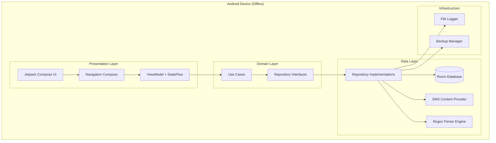

---

## 4. Technology Stack

### 4.1 Core Framework

| Component      | Technology                              | Rationale                                                                           |
| -------------- | --------------------------------------- | ----------------------------------------------------------------------------------- |
| **Language**   | Kotlin 2.0+                             | Modern, concise, coroutines for async                                               |
| **UI**         | Jetpack Compose + Material 3 Expressive | Declarative, modern, Google-recommended                                             |
| **Min SDK**    | 28 (Android 9.0)                        | SMS API available, broad device coverage                                            |
| **Target SDK** | 35 (Android 15)                         | Latest APIs and security patches. Note: Aug 31, 2026 requires API 36 for Play Store |

### 4.2 Architecture Components

| Component        | Technology                 | Rationale                                            |
| ---------------- | -------------------------- | ---------------------------------------------------- |
| **Architecture** | MVVM + Clean Architecture  | Testable, scalable separation of concerns            |
| **DI**           | Hilt (Dagger)              | Official Android DI, integrates with Compose         |
| **Navigation**   | Navigation Compose         | Type-safe, deep link support                         |
| **Async**        | Kotlin Coroutines + Flow   | Reactive data streams, structured concurrency        |
| **Database**     | Room (SQLite)              | Type-safe queries, migrations, LiveData/Flow support |
| **Logging**      | Custom FileLogger + Timber | Timber for debug, FileLogger for production dumps    |

### 4.3 Charts & Visualization

| Component  | Technology | Rationale                                                               |
| ---------- | ---------- | ----------------------------------------------------------------------- |
| **Charts** | Vico 2.5.x | Compose-native, Material 3 theming, bar/line/pie/donut charts, animated |

**Vico Chart Types Needed:**

| Chart       | Purpose                  | Vico Component                                                 |
| ----------- | ------------------------ | -------------------------------------------------------------- |
| Grouped Bar | Per-bank credit vs debit | `CartesianChartHost` + `ColumnCartesianLayer`                  |
| Stacked Bar | Category breakdown       | `CartesianChartHost` + `ColumnCartesianLayer` (stacked series) |
| Line        | Monthly trends over time | `CartesianChartHost` + `LineCartesianLayer`                    |
| Donut/Pie   | Category distribution    | `PieChartHost`                                                 |

### 4.4 Parsing Engine

| Component        | Technology                               | Rationale                                  |
| ---------------- | ---------------------------------------- | ------------------------------------------ |
| **Regex Engine** | Custom Kotlin regex engine               | Fastest, most reliable for known patterns  |
| **Rule Store**   | Room database with user-extensible rules | Users can add/edit bank patterns           |
| **Fallback**     | Manual entry                             | Users can always add transactions manually |

---

## 5. System Architecture (Detailed)

### 5.1 Clean Architecture Layers

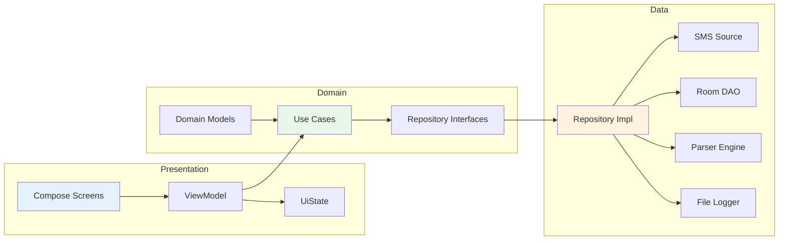

### 5.2 Module Structure

```
app/
├── core/
│   ├── database/          # Room entities, DAOs, migrations
│   ├── common/             # Shared utilities, extensions
│   └── logging/            # FileLogger implementation
├── data/
│   ├── repository/         # Repository implementations
│   ├── datasource/
│   │   ├── local/          # Room data source
│   │   └── sms/            # SMS ContentProvider reader
│   └── parser/             # SMS parsing engine
│       └── regex/          # Regex-based parser (only parser)
├── domain/
│   ├── model/              # Domain models (Transaction, Bank, Category)
│   ├── repository/         # Repository interfaces
│   └── usecase/            # Business logic use cases
├── presentation/
│   ├── home/               # Dashboard screen
│   ├── transactions/       # Transaction list screen
│   ├── parser/             # Parser test/customization screen
│   ├── settings/           # Settings screen
│   ├── charts/             # Chart components
│   └── navigation/         # Navigation graph
└── di/                     # Hilt modules
```

---

## 6. Database Design (ER Diagram)

### 6.1 Entity Relationship Diagram

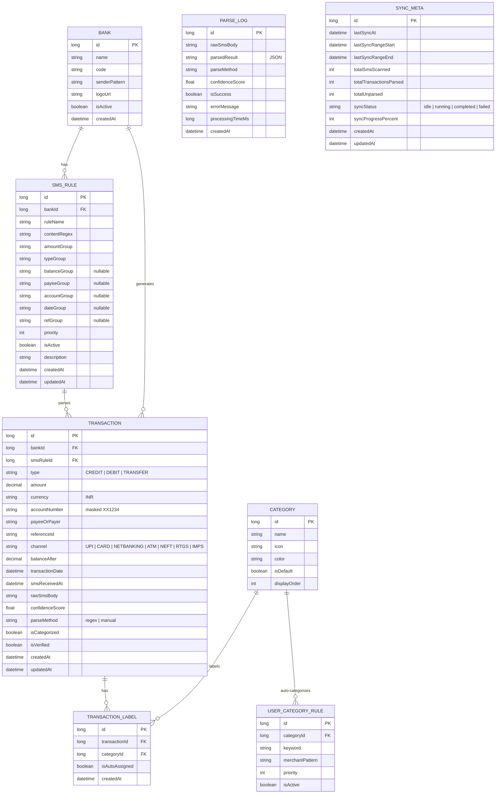

### 6.2 Key Entities Explained

#### Transaction Table (Core)

| Column            | Type   | Description                                                                                            |
| ----------------- | ------ | ------------------------------------------------------------------------------------------------------ |
| `type`            | Enum   | `CREDIT`, `DEBIT`, `REFUND`, `REVERSAL`, `WALLET_LOAD`, `E_MANDATE`                                    |
| `channel`         | Enum   | `UPI`, `CARD`, `ECOM`, `ATM`, `NET_BANKING`, `NEFT`, `RTGS`, `IMPS`, `ECS`, `SIP`, `WALLET`, `MANDATE` |
| `confidenceScore` | Float  | 0.0–1.0 parser confidence. Low confidence = needs manual review                                        |
| `parseMethod`     | String | How it was parsed: `regex`, `manual`                                                                   |
| `rawSmsBody`      | String | Original SMS for audit trail and re-parsing                                                            |

**Type Enum — derived from real SMS:**

| Type          | Keyword Triggers                                     | Example SMS                                                                      |
| ------------- | ---------------------------------------------------- | -------------------------------------------------------------------------------- |
| `CREDIT`      | `credited`, `deposited`, `loaded`                    | "credited to HDFC Bank A/c" / "deposited in HDFC Bank A/c" / "Meal Wallet on..." |
| `DEBIT`       | `debited`, `spent`, `deducted`, `txn`                | "debited for Rs" / "spent from Pluxee" / "deducted from HDFC"                    |
| `REFUND`      | `refunded`, `adjusted against`                       | "refunded by someComp & adjusted against HDFC Bank Credit Card"                  |
| `REVERSAL`    | `reversal against`                                   | "credited with INR ... as a reversal against a previous transaction"             |
| `WALLET_LOAD` | `loaded to`, `credited with ... towards Meal Wallet` | "credited with Rs.2200 towards Meal Wallet"                                      |
| `E_MANDATE`   | `deducted from ... towards ... UMRN`                 | "deducted from HDFC Bank A/C No 1234 towards Some CORP UMRN:"                    |

**Channel Enum — derived from real SMS:**

| Channel       | Keyword Triggers                               | Example SMS                                                          |
| ------------- | ---------------------------------------------- | -------------------------------------------------------------------- |
| `UPI`         | `via UPI`, `UPI:`, `from VPA`                  | "via UPI. Ref:" / "UPI:003637672623" / "from VPA yourupi@addr"       |
| `CARD`        | `On HDFC Bank Card`, `at POS`, `at AMAZON`     | "Spent Rs.4831.76 On HDFC Bank Card 1111 At Acme Inc."               |
| `ECOM`        | `POS/Ecom`, `Ecom txn`                         | "POS/Ecom txn to cafe de lar" (DCB)                                  |
| `NET_BANKING` | `via HDFC Bank NetBanking`                     | "from A/c \***\*\*\*\*\***1233 to SOMECORP via HDFC Bank NetBanking" |
| `NEFT`        | `for NEFT Cr-`, `NEFT from`                    | "for NEFT Cr-ICIC0099999-SOMECOMPANY"                                |
| `IMPS`        | `IMPS Ref. no.`, `by Account linked to mobile` | "IMPS Ref. no. 618441385660"                                         |
| `ECS`         | `UMRN`                                         | "UMRN: HDFC7011403241000251"                                         |
| `WALLET`      | `Meal Card wallet`, `Meal Wallet`              | "Pluxee Meal Card wallet"                                            |
| `MANDATE`     | `deducted from ... towards ... UMRN`           | e-Mandate auto-debit                                                 |

#### SMS_RULE Table (User-Extensible Parser)

Users select an existing bank or add a new bank, then create regex rules. Each rule maps a content regex pattern to named capture groups:

| Column         | Type    | Required | Description                                                                                    |
| -------------- | ------- | -------- | ---------------------------------------------------------------------------------------------- |
| `contentRegex` | String  | Yes      | Full regex pattern with Kotlin named groups for the SMS body                                   |
| `amountGroup`  | String  | Yes      | Name of the capture group that holds the transaction amount                                    |
| `typeGroup`    | String  | Yes      | Name of the capture group that holds the type (credit/debit), OR can be inferred from keywords |
| `balanceGroup` | String? | No       | Name of the capture group for account balance                                                  |
| `payeeGroup`   | String? | No       | Name of the capture group for payee/payer name                                                 |
| `accountGroup` | String? | No       | Name of the capture group for masked account number                                            |
| `dateGroup`    | String? | No       | Name of the capture group for transaction date                                                 |
| `refGroup`     | String? | No       | Name of the capture group for reference/transaction ID                                         |

---

## 7. SMS Parsing Pipeline

### 7.1 Regex-Only Parsing Flow

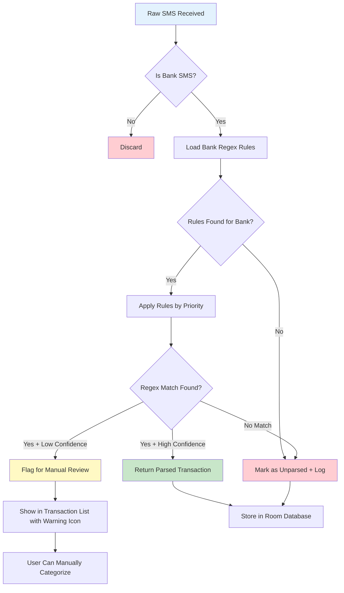

### 7.2 Bank SMS Detection Strategy

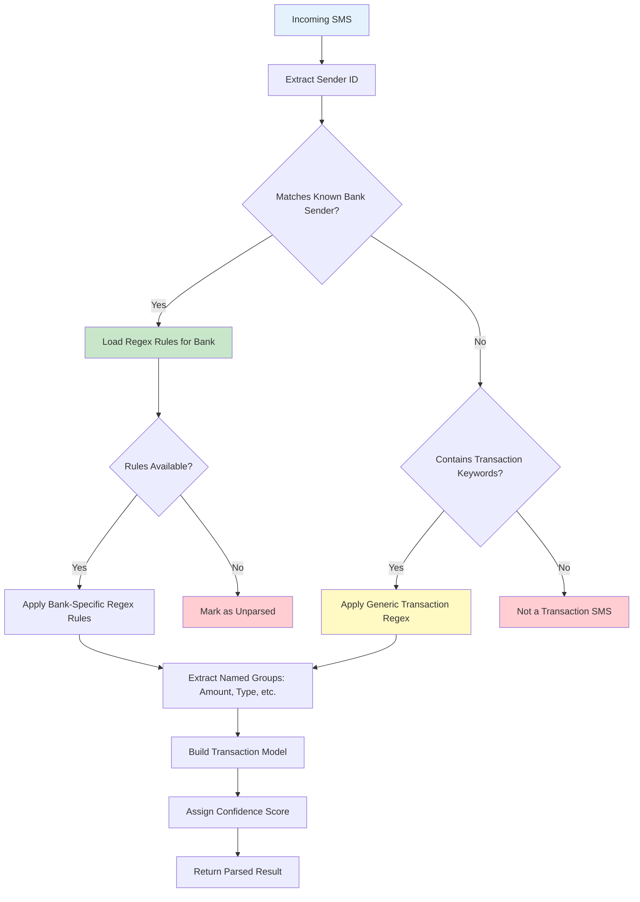

### 7.3 Bank Sender ID Detection

#### TRAI DLT Sender ID Format (2025+)

Indian sender IDs follow the TRAI DLT format: `XY-BANKNAME-SUFFIX`

| Part       | Meaning                            | Example                                                  |
| ---------- | ---------------------------------- | -------------------------------------------------------- |
| `XY`       | Telecom prefix (operator + circle) | `AD`, `VM`, `JD`, `JM`, `VD`                             |
| `BANKNAME` | Bank/entity identifier             | `HDFCBK`, `ICICIT`, `DCBANK`, `Pluxee`                   |
| `SUFFIX`   | Message category (TRAI DLT)        | `-S` (Service), `-T` (Transactional), `-P` (Promotional) |

**Suffix convention:**

- `-S` = Service Message (bank transaction alerts, balance updates)
- `-T` = Transactional Message (OTPs, authentication)
- `-P` = Promotional Message (offers, marketing)
- `-G` = General Message

**Detection strategy:** Strip the `-S`/`-T`/`-P`/`-G` suffix before matching against the bank's base sender pattern. For example, `AD-HDFCBK-S` -> base = `HDFCBK`.

#### Known Sender IDs (Verified from Real SMS)

| Bank                | Real Sender IDs Observed                                                  | Base Pattern    | Match Strategy               |
| ------------------- | ------------------------------------------------------------------------- | --------------- | ---------------------------- |
| **HDFC Bank**       | `AD-HDFCBK-S`, `VM-HDFCBK-S`, `JM-HDFCBK-S`, `VD-HDFCBK-S`, `JD-HDFCBK-S` | `HDFCBK`        | Contains `HDFCBK`            |
| **ICICI Bank**      | `AD-ICICIT-S`                                                             | `ICICIT`        | Contains `ICICIT`            |
| **DCB Bank**        | `JD-DCBANK-T`                                                             | `DCBANK`        | Contains `DCBANK`            |
| **Pluxee (Sodexo)** | `VD-Pluxee-S`, `JD-Pluxee-S`                                              | `Pluxee`        | Contains `Pluxee`            |
| **SBI**             | `SBIINB`, `SBICRD`, `AD-SBIINB`                                           | `SBI`           | Starts with `SBI`            |
| **Axis Bank**       | `AXISBK`, `AxisBk`, `AD-AXISBK`, `JD-AXISBK`                              | `AXIS`          | Contains `AXIS`              |
| **Kotak**           | `KOTAKB`, `KotakBk`                                                       | `KOTAK`         | Contains `KOTAK`             |
| **Yes Bank**        | `YESBNK`, `YesBank`                                                       | `YES`           | Starts with `YES`            |
| **IDFC First**      | `IDFCFB`, `IDFCF`                                                         | `IDFC`          | Starts with `IDFC`           |
| **IndusInd**        | `INDUSB`, `INDUSO`                                                        | `INDUS`         | Starts with `INDUS`          |
| **PNB**             | `PNBSMS`, `PNB`                                                           | `PNB`           | Starts with `PNB`            |
| **Bank of Baroda**  | `BOBSMS`, `BOB`                                                           | `BOB`           | Starts with `BOB`            |
| **Paytm**           | `Paytm`, `PYTM`                                                           | `Paytm\|PYTM`   | Contains `Paytm` or `PYTM`   |
| **PhonePe**         | `AD-PHNP`, `PHNPP`                                                        | `PHNP\|PhonePe` | Contains `PHNP` or `PhonePe` |
| **Google Pay**      | `AD-GPAY`, `GPAY`                                                         | `GPAY\|Google`  | Contains `GPAY` or `Google`  |
| **Amazon Pay**      | `AD-AMZN`, `AMZN`                                                         | `AMZN\|Amazon`  | Contains `AMZN` or `Amazon`  |
| **CRED**            | `AD-CREDP`, `CREDP`                                                       | `CRED`          | Contains `CRED`              |

#### Sender ID Detection Algorithm

```
1. Read SMS sender address (e.g., "AD-HDFCBK-S")
2. Strip TRAI DLT suffix (-S, -T, -P, -G) -> "AD-HDFCBK"
3. Extract base identifier after first "-" -> "HDFCBK"
4. Match against known bank patterns (contains check)
5. If no match -> check for transaction keywords in SMS body
6. If keywords found -> apply generic transaction regex
7. If no keywords -> discard as non-transaction SMS
```

#### User-Configurable Sender IDs

Users can configure sender IDs for banks not in the pre-configured list:

1. **Add New Bank** -> Enter bank name + sender pattern (regex)
2. **Pattern examples:**
   - `HDFCBK` — matches any sender containing "HDFCBK"
   - `DCBANK` — matches any sender containing "DCBANK"
   - `Pluxee` — matches any sender containing "Pluxee"
   - `(?i)mybank` — case-insensitive match for "mybank"
3. **Test against real SMS** — paste an SMS from the bank to verify the pattern matches
4. **Save** — pattern is stored in the BANK table and used for future SMS matching

---

## 8. Indian Bank SMS Patterns

### 8.1 Common SMS Formats

#### HDFC Bank — Debit

```
Your A/c XX3421 is debited for INR 1,500.00 on 15-07-26 by UPI Ref No 4829104720.
To VPA swiggy@ybl. Available Bal: INR 23,450.50
```

#### HDFC Bank — UPI Debit

```
Acct XX3421 debited INR 450.00 to SWIGGY via UPI. Ref: 4829104720.
Bal: INR 23,000.50
```

#### ICICI Bank — Debit

```
ICICI Bank Acct XX1234 debited INR 2,300.00 on 15-07-26.
IMPS to MOHIT KUMAR Ref# 4829104720. Avl Bal INR 45,670.25
```

#### ICICI Bank — Credit

```
ICICI Bank Acct XX1234 credited INR 50,000.00 on 15-07-26.
NEFT from RAHUL SHARMA Ref# NEFT123456. Avl Bal INR 95,670.25
```

#### SBI — Debit

```
Dear Customer, your SBI A/c X1234 debited by Rs.1,500.00 on 15/07/26.
IMPS P2A to 9876543210(UPI). Avl Bal Rs.23,450.50.
- SBI
```

#### SBI — Credit

```
Dear Customer, your SBI A/c X1234 is credited by Rs.50,000.00 on 15/07/26
by NEFT from ABCD LTD Ref No NEFT12345. Avl Bal Rs.73,450.50.
- SBI
```

#### Axis Bank — Debit

```
Axis Bank: Rs.2,500 debited from A/c XX5678 on 15-07-26 for UPI
txn to merchant@paytm. UPI Ref: 4829104720. Avl Bal: Rs.34,500.00
```

#### Kotak Bank — Debit

```
Kotak Bank: INR 899 debited from A/c XX9012 on 15-Jul-26 for
Netflix Subscription. Avl Bal: INR 12,345.67
```

### 8.2 Generic UPI SMS Pattern

```
Rs.{amount} {debited/credited} from/to {account/payer/payee}
via UPI. Ref: {reference}. Avl Bal: Rs.{balance}
```

### 8.3 Regex Extraction Groups

```kotlin
// Common regex groups — updated to match real SMS patterns

// Amount: "4831.76" or "1,000.00" or "546.00"
val amountGroup = "(?<amount>[\\d,]+\\.?\\d*)"

// Type: explicit keyword capture (nullable — use inference if null)
val typeGroup = "(?<type>debited|credited|spent|refunded|deducted|deposited|loaded)"

// Balance: "Avl bal Rs.9388.14" or "Bal: INR 23,000.50" or "Avl Bal INR 45,670.25"
val balanceGroup = "(?<balance>[\\d,]+\\.?\\d*)"

// Account: "XX1111" or "1111" or "*1234" or "**********1233"
val accountGroup = "(?<account>[Xx*]+\\d{3,4}|\\d{4})"

// Payee/Merchant: "Acme Inc." or "SWIGGY" or "cafe de lar" or "yourupi@addr"
val payeeGroup = "(?<payee>[A-Za-z][A-Za-z0-9 .@]+)"

// Reference: numeric UPI ref "620436716168" or alphanumeric "NEFT123456" or UMRN "HDFC7011403241000251"
val refGroup = "(?<ref>\\d{6,}|NEFT\\d+|HDFC\\w+)"

// Date: "2026-07-26:21:35:51" or "26-Jul-26" or "18-07-26" or "28-06-2026 21:38:47"
val dateGroup = "(?<date>[\\d]{2}[-/][\\w]+[-/][\\d]{2,4}(?:[\\s:]+\\d{2}:\\d{2}(?::\\d{2})?(?:\\s*[AP]M)?)"

// Channel: "POS/Ecom" or "UPI" or "NEFT"
val channelGroup = "(?<channel>POS/Ecom|UPI|NEFT|IMPS|NETBanking|ECS)"
```

### 8.4 Category Detection Keywords

| Category              | Keywords/Merchants                                                     |
| --------------------- | ---------------------------------------------------------------------- |
| **Food & Dining**     | swiggy, zomato, dominos, pizza, food, restaurant, cafe, 奶茶           |
| **Groceries**         | bigbasket, blinkit, zepto, dmart, grocery, supermarket, reliance fresh |
| **Fuel**              | petrol, diesel, hp, bpcl, iocl, shell, fuel, gas station               |
| **Bills & Utilities** | electricity, water, gas, broadband, jio, airtel, vi, bsnl, bill        |
| **Shopping**          | amazon, flipkart, meesho, ajio, myntra, mall                           |
| **Transport**         | uber, ola, rapido, metro, parking, toll                                |
| **Entertainment**     | netflix, prime, hotstar, spotify, movie, cinema                        |
| **Health**            | pharmacy, medical, hospital, doctor, clinic, health                    |
| **Education**         | school, college, university, course, book                              |
| **Salary**            | salary, payroll, wage                                                  |
| **Rent**              | rent, house, flat                                                      |
| **EMI/Loans**         | emi, loan, installment, sip                                            |

### 8.5 Detailed SMS Scenarios — 4 Banks + UPI + Pluxee

> **Source:** Real SMS examples verified against actual bank alerts (July 2026).

---

#### Scenario 1: HDFC Bank — Credit Card

**Sender IDs:** `AD-HDFCBK-S`, `VM-HDFCBK-S`, `JM-HDFCBK-S`, `VD-HDFCBK-S`, `JD-HDFCBK-S`

##### 1a. Merchant Transaction (Debit)

```
Spent Rs.4831.76 On HDFC Bank Card 1111 At Acme Inc. On 2026-07-26:21:35:51.Not You? To Block+Reissue Call 18002586161/SMS BLOCK CC 2468 to 7308080808
```

| Field     | Value               |
| --------- | ------------------- |
| Amount    | 4831.76             |
| Card      | 1111                |
| Merchant  | Acme Inc.           |
| Date/Time | 2026-07-26:21:35:51 |
| Type      | DEBIT               |

**Regex:** `Spent Rs\.(?<amount>[\d,.]+) On HDFC Bank Card (?<account>\d{4}) At (?<payee>[\w\s.@]+) On (?<date>[\d-]+:\d{2}:\d{2}:\d{2})`

##### 1b. UPI Transaction (Debit)

```
Txn Rs.25.00
On HDFC Bank Card 1111
At Q123456789@ybl
by UPI 620436716168
On 23-07
Not You?
Call 18002586161/SMS BLOCK CC 2468 to 7308080808
```

| Field        | Value          |
| ------------ | -------------- |
| Amount       | 25.00          |
| Card         | 1111           |
| VPA/Merchant | Q123456789@ybl |
| UPI Ref      | 620436716168   |
| Date         | 23-07          |
| Type         | DEBIT          |

**Regex:** `Txn Rs\.(?<amount>[\d,.]+)[\s\S]*?On HDFC Bank Card (?<account>\d{4})[\s\S]*?At (?<payee>[\w\s.@]+)[\s\S]*?by UPI (?<ref>\d+)[\s\S]*?On (?<date>[\d-]+)`

##### 1c. Refund/Credit

```
Alert! Rs. 32 refunded by someComp on 20/JUL/2026 & adjusted against HDFC Bank Credit Card 1111 View updated balance here: bank link
```

| Field    | Value       |
| -------- | ----------- |
| Amount   | 32          |
| Merchant | someComp    |
| Date     | 20/JUL/2026 |
| Card     | 1111        |
| Type     | CREDIT      |

**Regex:** `Alert! Rs\.? (?<amount>[\d,.]+) refunded by (?<payee>[\w\s]+) on (?<date>[\d/]+).*?HDFC Bank Credit Card (?<account>\d{4})`

---

#### Scenario 2: HDFC Bank — Debit Card / Account

**Sender IDs:** `AD-HDFCBK-S`, `VM-HDFCBK-S`, `JM-HDFCBK-S`, `VD-HDFCBK-S`, `JD-HDFCBK-S`

##### 2a. UPI Credit

```
Credit Alert!
Rs.12000.00 credited to HDFC Bank A/c XX1111 on 18-07-26 from VPA yourupi@addr (UPI 656540994008)
```

| Field   | Value        |
| ------- | ------------ |
| Amount  | 12000.00     |
| Account | XX1111       |
| Date    | 18-07-26     |
| VPA     | yourupi@addr |
| UPI Ref | 656540994008 |
| Type    | CREDIT       |

**Regex:** `Rs\.(?<amount>[\d,.]+) credited to HDFC Bank A/c (?<account>\w+) on (?<date>[\d-]+) from VPA (?<payee>[\w@.]+) \(UPI (?<ref>\d+)\)`

##### 2b. e-Mandate / Auto-Debit

```
PAYMENT ALERT!
INR 1000.00 deducted from HDFC Bank A/C No 1234 towards Some CORP UMRN: HDFC7011403241000251
```

| Field   | Value                |
| ------- | -------------------- |
| Amount  | 1000.00              |
| Account | 1234                 |
| Payee   | Some CORP            |
| UMRN    | HDFC7011403241000251 |
| Type    | DEBIT                |

**Regex:** `INR (?<amount>[\d,.]+) deducted from HDFC Bank A/C No (?<account>\d+) towards (?<payee>[\w\s]+) UMRN: (?<ref>\w+)`

##### 2c. NetBanking Transfer (Debit)

```
Payment Successful! Rs. 66093.00 from A/c **********1233 to SOMECORP via HDFC Bank NetBanking. Not you?Call 18002586161
```

| Field   | Value                |
| ------- | -------------------- |
| Amount  | 66093.00             |
| Account | \***\*\*\*\*\***1233 |
| Payee   | SOMECORP             |
| Type    | DEBIT                |

**Regex:** `Rs\.? (?<amount>[\d,.]+) from A/c (?<account>[\w*]+) to (?<payee>[\w\s]+) via HDFC Bank NetBanking`

##### 2d. Salary / NEFT Credit

```
Update! INR 1,000.00 deposited in HDFC Bank A/c XX1233 on 31-MAR-26 for NEFT Cr-ICIC0099999-SOMECOMPANY-someName.Avl bal INR 1,01,000.95. Cheque deposits in A/C are subject to clearing
```

| Field   | Value                            |
| ------- | -------------------------------- |
| Amount  | 1,000.00                         |
| Account | XX1233                           |
| Date    | 31-MAR-26                        |
| Payee   | ICIC0099999-SOMECOMPANY-someName |
| Balance | 1,01,000.95                      |
| Type    | CREDIT                           |

**Regex:** `INR (?<amount>[\d,.]+) deposited in HDFC Bank A/c (?<account>\w+) on (?<date>[\d-]+) for NEFT Cr-(?<payee>[\w-]+).*?Avl bal INR (?<balance>[\d,.]+)`

---

#### Scenario 3: ICICI Bank — Debit Card

**Sender IDs:** `AD-ICICIT-S`

##### 3a. UPI Debit

```
ICICI Bank Acct XX123 debited for Rs 242.00 on 26-Jul-26; BUS Ticket credited. UPI:003637672623. Call 18002662 for dispute. SMS BLOCK 796 to 9215676766.
```

| Field   | Value        |
| ------- | ------------ |
| Account | XX123        |
| Amount  | 242.00       |
| Date    | 26-Jul-26    |
| Payee   | BUS Ticket   |
| UPI Ref | 003637672623 |
| Type    | DEBIT        |

**Regex:** `ICICI Bank Acct (?<account>\w+) debited for Rs (?<amount>[\d,.]+) on (?<date>[\d-]+); (?<payee>[\w\s]+) credited\. UPI:(?<ref>\d+)`

##### 3b. UPI Credit

```
Dear Customer, Acct XX123 is credited with Rs 20.00 on 19-Jul-26 from NPCI BHIM. UPI:103691213332-ICICI Bank.
```

| Field   | Value        |
| ------- | ------------ |
| Account | XX123        |
| Amount  | 20.00        |
| Date    | 19-Jul-26    |
| Payee   | NPCI BHIM    |
| UPI Ref | 103691213332 |
| Type    | CREDIT       |

**Regex:** `Acct (?<account>\w+) is credited with Rs (?<amount>[\d,.]+) on (?<date>[\d-]+) from (?<payee>[\w\s]+)\. UPI:(?<ref>\d+)`

##### 3c. IMPS Credit

```
ICICI Bank Account XX123 is credited with Rs 61,000.00 on 03-Jul-26 by Account linked to mobile number XXXXX01234. IMPS Ref. no. 618441385660.
```

| Field    | Value             |
| -------- | ----------------- |
| Account  | XX123             |
| Amount   | 61,000.00         |
| Date     | 03-Jul-26         |
| Payee    | mobile XXXXX01234 |
| IMPS Ref | 618441385660      |
| Type     | CREDIT            |

**Regex:** `ICICI Bank Account (?<account>\w+) is credited with Rs (?<amount>[\d,.]+) on (?<date>[\d-]+) by Account linked to mobile number (?<payee>[\w]+)\. IMPS Ref\. no\. (?<ref>\d+)`

---

#### Scenario 4: DCB Bank — Debit Card

**Sender IDs:** `JD-DCBANK-T`

##### 4a. POS/Ecom Debit

```
INR 1403.36 debited DCB Bank a/c*1234 POS/Ecom txn to cafe de lar on 19-06-2026 07:59 PM.Not you?Call 0226899777 or SMS BLOCKCARD <Last 4 digits>to 9821878789
```

| Field     | Value               |
| --------- | ------------------- |
| Amount    | 1403.36             |
| Account   | \*1234              |
| Channel   | POS/Ecom            |
| Merchant  | cafe de lar         |
| Date/Time | 19-06-2026 07:59 PM |
| Type      | DEBIT               |

**Regex:** `INR (?<amount>[\d,.]+) debited DCB Bank a/c(?<account>\*\d+) (?<channel>POS/Ecom) txn to (?<payee>[\w\s]+) on (?<date>[\d-]+ \d{2}:\d{2} [AP]M)`

---

#### Scenario 5: UPI Transaction (Generic — Any Bank)

UPI transactions are sent by the user's own bank (HDFC, ICICI, SBI, etc.) using the bank's sender ID. The SMS format varies by bank. Use bank-specific rules above when possible.

**Common UPI debit pattern (cross-bank):**

```
Rs.{amount} debited from A/c {account} to {payee} via UPI. Ref: {ref}. Avl Bal: Rs.{balance}
```

**Common UPI credit pattern (cross-bank):**

```
Rs.{amount} credited to A/c {account} from VPA {vpa} (UPI {ref})
```

Use the bank-specific rules from Scenarios 1–4 for best accuracy.

---

#### Scenario 6: Pluxee (Sodexo) Meal Card

**Sender IDs:** `VD-Pluxee-S`, `JD-Pluxee-S`

##### 6a. Meal Spend (Debit)

```
Rs. 546.00 spent from Pluxee  Meal Card wallet, card no.xx4910 on 28-06-2026 21:38:47 at SWIGGY . Avl bal Rs.9388.14. Not you call 18002106919
```

| Field     | Value               |
| --------- | ------------------- |
| Amount    | 546.00              |
| Card      | xx4910              |
| Merchant  | SWIGGY              |
| Date/Time | 28-06-2026 21:38:47 |
| Balance   | 9388.14             |
| Type      | DEBIT               |

**Regex:** `Rs\. (?<amount>[\d,.]+) spent from Pluxee\s+Meal Card wallet, card no\.(?<account>\w+) on (?<date>[\d-]+ \d{2}:\d{2}:\d{2}) at (?<payee>[\w\s]+)\. Avl bal Rs\.(?<balance>[\d,.]+)`

##### 6b. Reversal (Credit)

```
Your Pluxee Card xx4910 has been credited with INR 546.00 on Sun Jun 28 2026 22:41:31as a reversal against a previous transaction on Jun 28,2026 21:38:47.
```

| Field     | Value                    |
| --------- | ------------------------ |
| Card      | xx4910                   |
| Amount    | 546.00                   |
| Date/Time | Sun Jun 28 2026 22:41:31 |
| Type      | CREDIT                   |

**Regex:** `Your Pluxee Card (?<account>\w+) has been credited with INR (?<amount>[\d,.]+) on (?<date>\w+ [\d]+ [\d]+ [\d]+:[\d]+:[\d]+)as a reversal`

##### 6c. Wallet Load (Credit)

```
Your Pluxee Card has been successfully credited with Rs.2200 towards  Meal Wallet on Thu Sep 05 2024 17:03:06. Your current Meal Wallet balance is Rs.7142.70.
```

| Field     | Value                    |
| --------- | ------------------------ |
| Amount    | 2200                     |
| Date/Time | Thu Sep 05 2024 17:03:06 |
| Balance   | 7142.70                  |
| Type      | CREDIT                   |

**Regex:** `Your Pluxee Card has been successfully credited with Rs\.(?<amount>[\d,.]+) towards\s+Meal Wallet on (?<date>\w+ [\d]+ [\d]+ [\d]+:[\d]+:[\d]+)\. Your current Meal Wallet balance is Rs\.(?<balance>[\d,.]+)`

---

## 9. User-Extensible Regex System

### 9.1 Overview

The SMS Expense Tracker uses a **regex-only** parsing approach. Users can:

1. **Select an existing bank** from the pre-configured list (15+ Indian banks)
2. **Add a new bank** with custom sender pattern
3. **Create and edit SMS rules** per bank using regex with named capture groups
4. **Test rules** against sample SMS text in real-time

### 9.2 Rule Model

Each `SMS_RULE` contains:

| Field          | Type    | Required | Description                                                            |
| -------------- | ------- | -------- | ---------------------------------------------------------------------- |
| `ruleName`     | String  | Yes      | Human-readable name (e.g., "HDFC UPI Debit")                           |
| `contentRegex` | String  | Yes      | Full regex pattern with Kotlin named groups                            |
| `amountGroup`  | String  | Yes      | Name of the capture group holding the amount                           |
| `typeGroup`    | String  | Yes      | Name of the capture group holding the type, OR keyword-based inference |
| `balanceGroup` | String? | No       | Name of the capture group for balance                                  |
| `payeeGroup`   | String? | No       | Name of the capture group for payee/payer                              |
| `accountGroup` | String? | No       | Name of the capture group for masked account number                    |
| `dateGroup`    | String? | No       | Name of the capture group for transaction date                         |
| `refGroup`     | String? | No       | Name of the capture group for reference ID                             |
| `priority`     | Int     | Yes      | Evaluation order (lower = higher priority)                             |
| `isActive`     | Boolean | Yes      | Enable/disable rule                                                    |

### 9.3 contentRegex Syntax

The `contentRegex` field uses standard Kotlin regex with **named capture groups** using the `(?<name>pattern)` syntax.

**Required capture groups:**

- `amount` — Transaction amount (e.g., `(?<amount>[\d,.]+)`)
- `type` — Transaction type, OR keyword inference (see 9.4)

**Optional capture groups (nullable):**

- `balance` — Account balance after transaction
- `payee` — Merchant/payee/payer name
- `account` — Masked account number
- `date` — Transaction date
- `ref` — Transaction reference ID

### 9.4 Type Inference Strategy

The `typeGroup` field supports two modes:

**Mode 1: Named Capture Group**
If the SMS contains an explicit type word that can be captured:

```regex
(?<type>debited|credited|spent|refunded|deducted|deposited|loaded)
```

**Mode 2: Keyword Inference (when `typeGroup` is null or empty)**
The system scans the full SMS body for type-determining keywords:

| Keyword                             | Inferred Type     | Example SMS                                                                 |
| ----------------------------------- | ----------------- | --------------------------------------------------------------------------- |
| `debited`, `debit`                  | DEBIT             | "ICICI Bank Acct XX123 debited for Rs 242.00"                               |
| `spent`                             | DEBIT             | "Rs. 546.00 spent from Pluxee Meal Card wallet"                             |
| `deducted`                          | DEBIT / E_MANDATE | "INR 1000.00 deducted from HDFC Bank A/C No 1234 towards Some CORP UMRN:"   |
| `txn`                               | DEBIT             | "POS/Ecom txn to cafe de lar" (DCB)                                         |
| `credited`, `credit`                | CREDIT            | "Rs.12000.00 credited to HDFC Bank A/c XX1111"                              |
| `deposited`                         | CREDIT            | "INR 1,000.00 deposited in HDFC Bank A/c XX1233"                            |
| `refunded`                          | REFUND            | "Rs. 32 refunded by someComp & adjusted against HDFC Bank Credit Card"      |
| `reversal`                          | REVERSAL          | "credited with INR 546.00 ... as a reversal against a previous transaction" |
| `loaded to` / `towards Meal Wallet` | WALLET_LOAD       | "credited with Rs.2200 towards Meal Wallet"                                 |

**Type inference priority:**

1. If `typeGroup` is set -> use named capture group value
2. If `typeGroup` is null -> scan SMS body for keywords in priority order
3. If `deducted` + `UMRN` -> type = `E_MANDATE` (not just `DEBIT`)
4. If `refunded` or `adjusted against` -> type = `REFUND`
5. If `reversal against` -> type = `REVERSAL`
6. If `loaded to` or `towards Meal Wallet` -> type = `WALLET_LOAD`
7. Default fallback -> `DEBIT` (most common)

### 9.5 Example Rules

#### HDFC Credit Card — Merchant Debit

```regex
Spent Rs\.(?<amount>[\d,.]+) On HDFC Bank Card (?<account>\d{4}) At (?<payee>[\w\s.@]+) On (?<date>[\d-]+:\d{2}:\d{2}:\d{2})
```

- `amountGroup` = `"amount"`
- `typeGroup` = null (inferred from "Spent" -> DEBIT)
- `balanceGroup` = null (not in this SMS format)
- `payeeGroup` = `"payee"`
- `accountGroup` = `"account"`
- `dateGroup` = `"date"`
- `refGroup` = null

#### HDFC Debit Card — UPI Credit

```regex
Rs\.(?<amount>[\d,.]+) credited to HDFC Bank A/c (?<account>\w+) on (?<date>[\d-]+) from VPA (?<payee>[\w@.]+) \(UPI (?<ref>\d+)\)
```

- `amountGroup` = `"amount"`
- `typeGroup` = null (inferred from "credited" -> CREDIT)
- `balanceGroup` = null (not in this SMS)
- `payeeGroup` = `"payee"`
- `accountGroup` = `"account"`
- `dateGroup` = `"date"`
- `refGroup` = `"ref"`

#### ICICI Bank — UPI Debit

```regex
ICICI Bank Acct (?<account>\w+) debited for Rs (?<amount>[\d,.]+) on (?<date>[\d-]+); (?<payee>[\w\s]+) credited\. UPI:(?<ref>\d+)
```

- `amountGroup` = `"amount"`
- `typeGroup` = null (inferred from "debited" -> DEBIT)
- `balanceGroup` = null
- `payeeGroup` = `"payee"`
- `accountGroup` = `"account"`
- `dateGroup` = `"date"`
- `refGroup` = `"ref"`

#### DCB Bank — POS/Ecom Debit

```regex
INR (?<amount>[\d,.]+) debited DCB Bank a/c(?<account>\*\d+) (?<channel>POS/Ecom) txn to (?<payee>[\w\s]+) on (?<date>[\d-]+ \d{2}:\d{2} [AP]M)
```

- `amountGroup` = `"amount"`
- `typeGroup` = null (inferred from "debited" -> DEBIT)
- `balanceGroup` = null
- `payeeGroup` = `"payee"`
- `accountGroup` = `"account"`
- `dateGroup` = `"date"`
- `refGroup` = null

#### Pluxee — Meal Spend

```regex
Rs\. (?<amount>[\d,.]+) spent from Pluxee\s+Meal Card wallet, card no\.(?<account>\w+) on (?<date>[\d-]+ \d{2}:\d{2}:\d{2}) at (?<payee>[\w\s]+)\. Avl bal Rs\.(?<balance>[\d,.]+)
```

- `amountGroup` = `"amount"`
- `typeGroup` = null (inferred from "spent" -> DEBIT)
- `balanceGroup` = `"balance"`
- `payeeGroup` = `"payee"`
- `accountGroup` = `"account"`
- `dateGroup` = `"date"`
- `refGroup` = null

### 9.6 Bank Management Flow

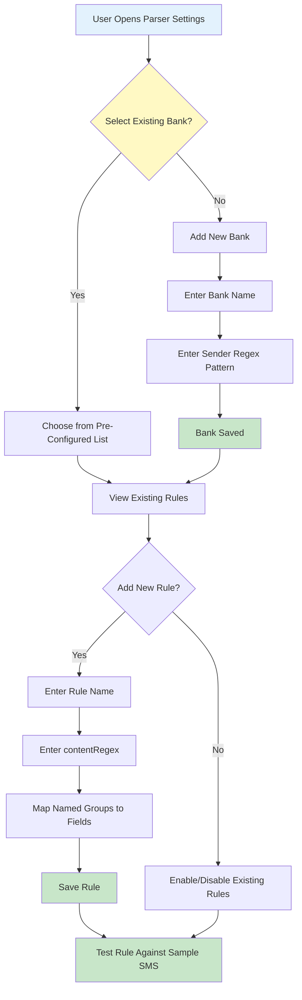

### 9.7 Pre-Configured Banks

The app ships with pre-configured rules for banks verified from real SMS:

| Bank            | Pre-configured Rules                                                                   | Sender Pattern  | Verified |
| --------------- | -------------------------------------------------------------------------------------- | --------------- | -------- |
| HDFC Bank       | CC Merchant, CC UPI, CC Refund, Debit UPI Credit, e-Mandate, NetBanking, Salary Credit | `HDFCBK`        | Yes      |
| ICICI Bank      | UPI Debit, UPI Credit, IMPS Credit                                                     | `ICICIT`        | Yes      |
| DCB Bank        | POS/Ecom Debit                                                                         | `DCBANK`        | Yes      |
| Pluxee (Sodexo) | Meal Spend, Reversal, Wallet Load                                                      | `Pluxee`        | Yes      |
| SBI             | Debit, Credit, IMPS                                                                    | `SBI`           | No       |
| Axis Bank       | UPI Debit, Credit                                                                      | `AXIS`          | No       |
| Kotak Bank      | Debit, Credit                                                                          | `KOTAK`         | No       |
| Yes Bank        | Debit, Credit                                                                          | `YES`           | No       |
| IDFC First      | Debit, Credit                                                                          | `IDFC`          | No       |
| IndusInd        | Debit, Credit                                                                          | `INDUS`         | No       |
| PNB             | Debit, Credit                                                                          | `PNB`           | No       |
| Bank of Baroda  | Debit, Credit                                                                          | `BOB`           | No       |
| Paytm           | UPI Debit, Credit                                                                      | `Paytm\|PYTM`   | No       |
| PhonePe         | UPI Debit, Credit                                                                      | `PHNP\|PhonePe` | No       |
| Google Pay      | UPI Debit, Credit                                                                      | `GPAY\|Google`  | No       |
| Amazon Pay      | UPI Debit, Credit                                                                      | `AMZN\|Amazon`  | No       |
| CRED            | UPI Debit                                                                              | `CRED`          | No       |

> **Note:** Banks marked "Verified" have rules created from real SMS examples. Others use reconstructed patterns that may need verification.

### 9.8 Parser Test Interface

The Parser Test screen provides:

1. **SMS Text Input** — paste or type raw SMS
2. **Bank Selector** — choose bank or auto-detect from sender
3. **Parse Button** — execute regex rules against input
4. **Result Display** — show all extracted fields with confidence
5. **Rule Editor** — create/edit regex rules with live testing
6. **Test Bank Patterns** — run all rules against sample SMS

---

## 10. UI/UX Architecture

### 10.1 Screen Architecture

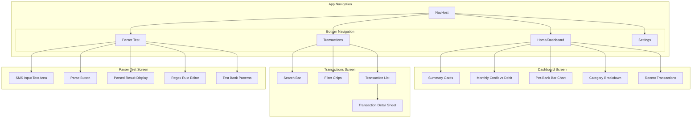

### 10.2 Dashboard Layout

```
┌─────────────────────────────────┐
│  💰 Total Spent: ₹45,670       │
│  📈 Total Received: ₹1,25,000  │
│  📊 Net: ₹79,330               │
├─────────────────────────────────┤
│  [Monthly Credit vs Debit]      │
│  ┃███░░┃ Credit                │
│  ┃░░░██┃ Debit                 │
│  ┗━━━━━┛                       │
│  Jan  Feb  Mar  Apr  May  Jun  │
├─────────────────────────────────┤
│  [Per-Bank Comparison]          │
│  HDFC: ████░░░░  ₹15,000       │
│  SBI:  ██░░░░░░  ₹8,000        │
│  ICICI:██████░░  ₹22,000       │
├─────────────────────────────────┤
│  [Category Breakdown - Donut]   │
│  🍕 Food: 35%                   │
│  🛒 Groceries: 20%              │
│  ⛽ Fuel: 15%                   │
│  📱 Bills: 10%                  │
│  🛍️ Shopping: 20%              │
├─────────────────────────────────┤
│  [Recent Transactions]          │
│  -> Swiggy - ₹450 (Food)        │
│  -> Amazon - ₹1,200 (Shopping)  │
│  -> HP Petrol - ₹2,000 (Fuel)   │
└─────────────────────────────────┘
```

### 10.3 Material 3 Expressive Design Tokens

```kotlin
// Material 3 Expressive color scheme
val AppColorScheme = lightColorScheme(
    primary = Color(0xFF1A73E8),        // Google Blue
    onPrimary = Color.White,
    primaryContainer = Color(0xFFD3E3FD),
    secondary = Color(0xFF34A853),       // Green for credits
    error = Color(0xFFEA4335),           // Red for debits
    surface = Color(0xFFF8FAFB),
    // ... additional M3 Expressive tokens
)

// Expressive shapes with motion
val AppShapes = Shapes(
    extraSmall = RoundedCornerShape(8.dp),
    small = RoundedCornerShape(12.dp),
    medium = RoundedCornerShape(16.dp),
    large = RoundedCornerShape(24.dp),
    extraLarge = RoundedCornerShape(32.dp)
)
```

---

## 11. Onboarding & SMS Sync Flow

### 11.1 Onboarding UX Principle

> **"Show, don't block."** The user sees the full app UI from the moment they open it. Empty states explain what will appear. Data populates in the background. The user is never stuck on a loading screen.

### 11.2 Onboarding Flow

```mermaid
flowchart TD
    A[App First Launch] --> B[Show Empty Dashboard]
    B --> C{User taps Sync button\nor tries to view data?}

    C -->|Yes| D[Permission Explanation Screen]
    D --> E[Request READ_SMS Permission]
    E --> F{Permission Granted?}

    F -->|No| G[Show "Permission Required" message\nwith Settings redirect]
    F -->|Yes| H[Request RECEIVE_SMS Permission]
    H --> I{Permission Granted?}

    I -->|No| J[Proceed with READ_SMS only\n(real-time sync disabled)]
    I -->|Yes| K[Sync Range Selection BottomSheet]

    J --> K

    K --> L{User selects range}
    L -->|1 Day| M[Start Background Sync]
    L -->|1 Week| M
    L -->|2 Weeks| M
    L -->|1 Month| M
    L -->|3 Months| M
    L -->|All SMS| M

    M --> N[Show "Scanning SMS..." banner on Dashboard]
    N --> O[Background Worker processes SMS in batches]
    O --> P[Dashboard live-updates as transactions are parsed]
    P --> Q[Sync Complete -> Hide banner]

    G --> R[User can still use manual entry]
    J --> K

    style A fill:#E3F2FD
    style B fill:#FFF9C4
    style N fill:#FFF9C4
    style Q fill:#C8E6C9
    style G fill:#FFCDD2
```

### 11.3 Screen States

#### Dashboard — Empty State (Before Permission)

```
┌─────────────────────────────────┐
│  💰 Total Spent: ₹0            │
│  📈 Total Received: ₹0         │
│  📊 Net: ₹0                    │
├─────────────────────────────────┤
│                                 │
│  [Empty Illustration]           │
│                                 │
│  "No transactions yet"          │
│  "Sync your bank SMS to see     │
│   your expenses here"           │
│                                 │
│  [ Sync SMS ] ← Primary CTA    │
│  [ Add Manually ]              │
│                                 │
├─────────────────────────────────┤
│  [Charts show empty/zero state] │
└─────────────────────────────────┘
```

#### Dashboard — Processing State (During Sync)

```
┌─────────────────────────────────┐
│  ⏳ Syncing SMS... 234 of 500   │ ← Progress banner
│  ████████████░░░░░░ 47%         │
├─────────────────────────────────┤
│  💰 Total Spent: ₹12,450 ↑     │ ← Live updates
│  📈 Total Received: ₹50,000 ↑  │
│  📊 Net: ₹37,550               │
├─────────────────────────────────┤
│  [Charts populate incrementally]│
├─────────────────────────────────┤
│  [Recent Transactions]          │
│  -> Swiggy - ₹450 (Food)        │ ← Already parsed ones
│  -> Amazon - ₹1,200 (Shopping)  │
│  ...                            │
└─────────────────────────────────┘
```

#### Dashboard — Sync Complete

```
┌─────────────────────────────────┐
│  ✅ 500 SMS scanned             │ ← Summary banner (auto-hides)
│  47 transactions found          │
│  3 unparsed (view)              │
├─────────────────────────────────┤
│  💰 Total Spent: ₹45,670       │
│  📈 Total Received: ₹1,25,000  │
│  📊 Net: ₹79,330               │
├─────────────────────────────────┤
│  [Full charts and data]         │
└─────────────────────────────────┘
```

### 11.4 Sync Range Options

| Range        | Description   | Use Case                       |
| ------------ | ------------- | ------------------------------ |
| **1 Day**    | Last 24 hours | Quick check, new user testing  |
| **1 Week**   | Last 7 days   | Recent spending review         |
| **2 Weeks**  | Last 14 days  | Default recommended            |
| **1 Month**  | Last 30 days  | Monthly overview               |
| **3 Months** | Last 90 days  | Quarterly analysis             |
| **All SMS**  | Entire inbox  | Full history (may take longer) |

### 11.5 Background Sync Mechanism

```
WorkManager Task (SmsSyncWorker)
├── Step 1: Query ContentProvider for SMS in date range
│   └── Filter by known sender ID patterns
├── Step 2: Process in batches of 50 SMS
│   ├── Apply bank-specific regex rules
│   ├── Extract transaction fields
│   ├── Assign confidence score
│   └── Insert into Room database
├── Step 3: Update progress
│   └── Publish progress via WorkManager state
├── Step 4: Handle unparsed SMS
│   ├── Log to unparsed_sms.txt
│   └── Show count in UI
└── Step 5: Complete
    └── Show summary banner
```

**Key behaviors:**

- **Non-blocking:** Worker runs in background, UI stays interactive
- **Incremental:** Dashboard updates as batches are processed
- **Resumable:** If app is killed, worker resumes on next launch
- **Deduplication:** SMS are deduped by `date + address + body` hash before insert
- **Progress:** Published via `WorkManager.getWorkInfoByIdFlow()` observed by ViewModel

### 11.6 Permission Flow

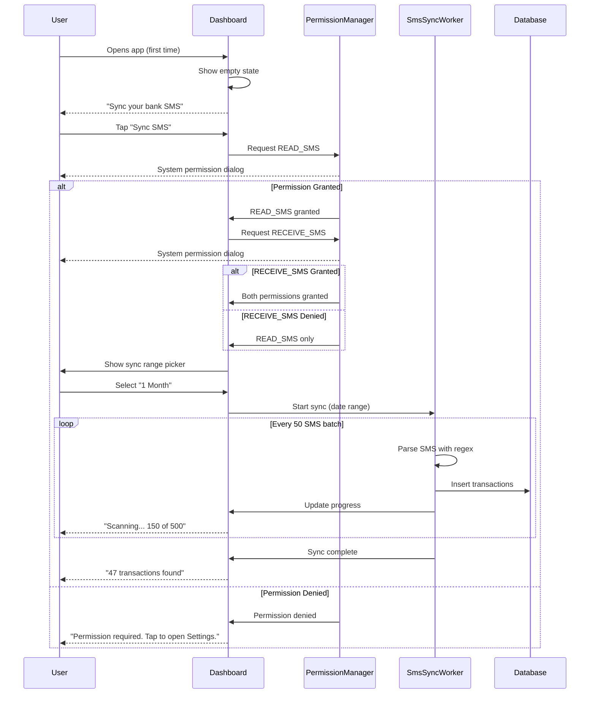

### 11.7 Re-Sync & Incremental Sync

| Trigger                                    | Action                                                                               |
| ------------------------------------------ | ------------------------------------------------------------------------------------ |
| **App opens**                              | Check last sync timestamp. If >24h since last sync, run incremental sync for new SMS |
| **User taps "Re-Sync"**                    | Full re-scan of selected range, dedup before insert                                  |
| **New SMS received** (RECEIVE_SMS granted) | BroadcastReceiver triggers immediate parse for known bank senders                    |
| **User changes bank rules**                | Option to "Re-parse unparsed SMS" with new rules                                     |

---

## 12. Sequence Diagrams

### 12.1 SMS Reading & Parsing Sequence

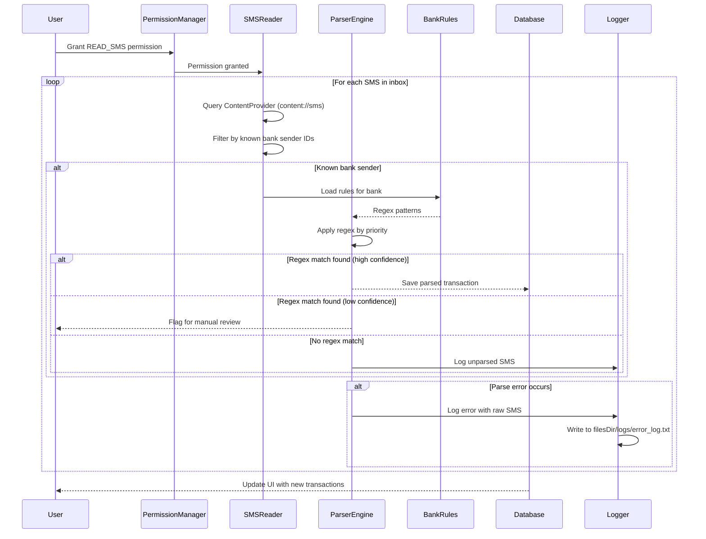

### 12.2 Transaction List & Labeling Sequence

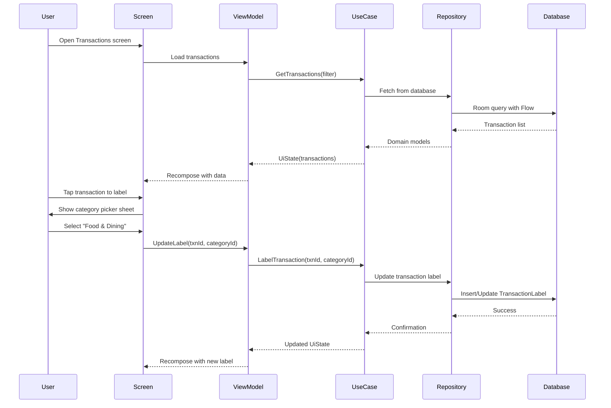

### 12.3 Parser Test Sequence

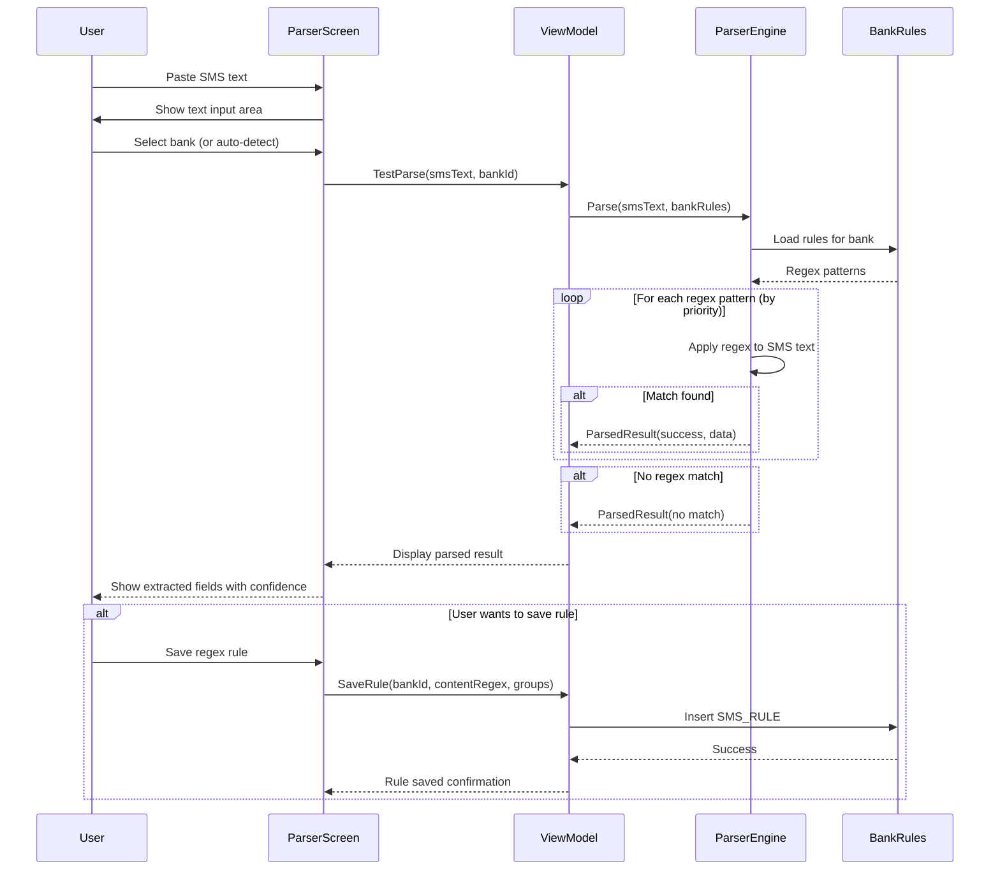

---

## 13. Data Flow Diagrams

### 13.1 System Data Flow (Context Diagram)

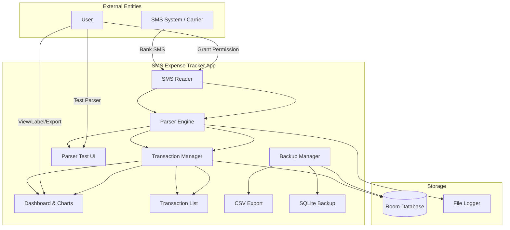

### 13.2 Detailed Data Flow — SMS to Transaction

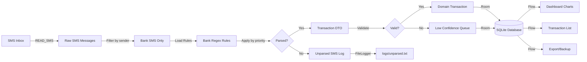

### 13.3 Backup Data Flow

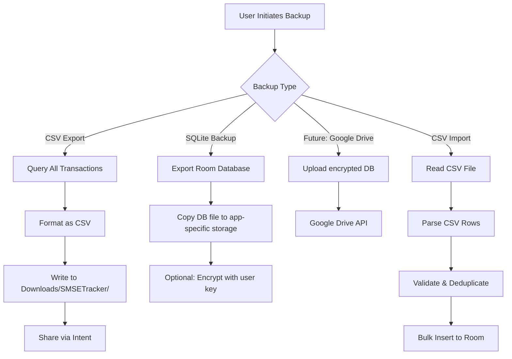

---

## 14. Error Logging Strategy

### 14.1 Log File Structure

```
context.filesDir/
├── logs/
│   ├── error_log.txt          # All errors with timestamps
│   ├── parse_failures.txt     # SMS that failed to parse
│   ├── parse_success.txt      # Successfully parsed SMS (optional)
│   ├── unparsed_sms.txt       # SMS that didn't match any pattern
│   └── crash_log.txt          # Uncaught exceptions
├── backups/
│   ├── sms_expense_backup_2026_07_25.csv
│   └── sms_expense_2026_07_25.db
└── database/
    └── sms_expense_tracker.db  # Room database
```

### 14.2 Logger Implementation

```kotlin
class FileLogger(private val context: Context) {

    private val logDir: File = File(context.filesDir, "logs").apply {
        mkdirs()
    }

    fun logError(tag: String, message: String, throwable: Throwable? = null) {
        val timestamp = SimpleDateFormat("yyyy-MM-dd HH:mm:ss", Locale.US).format(Date())
        val logEntry = buildString {
            appendLine("[$timestamp] [$tag]")
            appendLine("  Message: $message")
            throwable?.let {
                appendLine("  Exception: ${it.javaClass.simpleName}: ${it.message}")
                appendLine("  StackTrace: ${it.stackTraceToString()}")
            }
            appendLine("---")
        }

        File(logDir, "error_log.txt").appendText(logEntry)
    }

    fun logParseFailure(rawSms: String, error: String, bankId: Long?) {
        val timestamp = SimpleDateFormat("yyyy-MM-dd HH:mm:ss", Locale.US).format(Date())
        val logEntry = "[$timestamp] BankID=$bankId | Error=$error | SMS=$rawSms\n---\n"

        File(logDir, "parse_failures.txt").appendText(logEntry)
    }

    fun logUnparsedSms(rawSms: String, sender: String) {
        val timestamp = SimpleDateFormat("yyyy-MM-dd HH:mm:ss", Locale.US).format(Date())
        val logEntry = "[$timestamp] Sender=$sender | SMS=$rawSms\n---\n"

        File(logDir, "unparsed_sms.txt").appendText(logEntry)
    }

    fun getLogFiles(): List<File> = logDir.listFiles()?.toList() ?: emptyList()

    fun clearOldLogs(olderThanDays: Int = 30) {
        val cutoff = System.currentTimeMillis() - (olderThanDays * 24 * 60 * 60 * 1000L)
        logDir.listFiles()?.forEach { file ->
            if (file.lastModified() < cutoff) file.delete()
        }
    }
}
```

### 14.3 Log Viewer in App

The **Parser Test** screen includes a "View Logs" section where users can:

- See recent parse failures
- View error logs
- Export logs as a shareable text file
- Clear old logs

---

## 15. Testing Strategy

### 15.1 Testing Pyramid

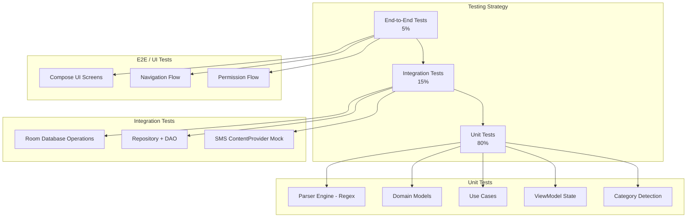

### 15.2 SMS Testing Solutions

#### Problem: Emulators Don't Have Real SMS

**Solution 1: Mock SMS Database via ADB**

```bash
# Insert test SMS into emulator
adb shell content insert --uri content://sms \
    --bind address:s:JD-HDFCBK-S \
    --bind body:s:"Your A/c XX3421 is debited for INR 1,500.00 on 15-07-26 by UPI Ref No 4829104720. To VPA swiggy@ybl. Available Bal: INR 23,450.50" \
    --bind date:l:1689432000000 \
    --bind type:i:1
```

**Solution 2: In-App Test SMS Parser**

Users can paste raw SMS text directly into the app's "Parser Test" screen to test parsing without needing actual SMS messages.

**Solution 3: Mock SMS Provider for Tests**

```kotlin
// In androidTest
class MockSmsContentProvider : ContentProvider() {
    private val testSms = listOf(
        SmsMessage("JD-HDFCBK-S", "Your A/c XX3421 debited INR 1500...", 1689432000000),
        // More test messages...
    )

    override fun query(...): Cursor {
        // Return test SMS data
    }
}
```

**Solution 4: SMS Import Feature**

Allow users to import SMS from a text file (one SMS per line) for testing the parser.

### 15.3 Test Data - Indian Bank SMS Samples

Create a comprehensive test suite with real-world SMS patterns:

```kotlin
val testSmsSamples = mapOf(
    // HDFC Credit Card
    "HDFC_CC_MERCHANT_DEBIT" to "Spent Rs.4831.76 On HDFC Bank Card 1111 At Acme Inc. On 2026-07-26:21:35:51.Not You? To Block+Reissue Call 18002586161/SMS BLOCK CC 2468 to 7308080808",
    "HDFC_CC_UPI_DEBIT" to "Txn Rs.25.00\nOn HDFC Bank Card 1111\nAt Q123456789@ybl \nby UPI 620436716168\nOn 23-07\nNot You?\nCall 18002586161/SMS BLOCK CC 2468 to 7308080808",
    "HDFC_CC_REFUND" to "Alert! Rs. 32 refunded by someComp on 20/JUL/2026 & adjusted against HDFC Bank Credit Card 1111 View updated balance here: bank link",

    // HDFC Debit / Account
    "HDFC_DEBIT_UPI_CREDIT" to "Credit Alert!\nRs.12000.00 credited to HDFC Bank A/c XX1111 on 18-07-26 from VPA yourupi@addr (UPI 656540994008)",
    "HDFC_E_MANDATE" to "PAYMENT ALERT! \nINR 1000.00 deducted from HDFC Bank A/C No 1234 towards Some CORP UMRN: HDFC7011403241000251",
    "HDFC_NETBANKING" to "Payment Successful! Rs. 66093.00 from A/c **********1233 to SOMECORP via HDFC Bank NetBanking. Not you?Call 18002586161",
    "HDFC_SALARY_CREDIT" to "Update! INR 1,000.00 deposited in HDFC Bank A/c XX1233 on 31-MAR-26 for NEFT Cr-ICIC0099999-SOMECOMPANY-someName.Avl bal INR 1,01,000.95. Cheque deposits in A/C are subject to clearing",

    // ICICI Bank
    "ICICI_UPI_DEBIT" to "ICICI Bank Acct XX123 debited for Rs 242.00 on 26-Jul-26; BUS Ticket credited. UPI:003637672623. Call 18002662 for dispute. SMS BLOCK 796 to 9215676766.",
    "ICICI_UPI_CREDIT" to "Dear Customer, Acct XX123 is credited with Rs 20.00 on 19-Jul-26 from NPCI BHIM. UPI:103691213332-ICICI Bank.",
    "ICICI_IMPS_CREDIT" to "ICICI Bank Account XX123 is credited with Rs 61,000.00 on 03-Jul-26 by Account linked to mobile number XXXXX01234. IMPS Ref. no. 618441385660.",

    // DCB Bank
    "DCB_POS_ECOM_DEBIT" to "INR 1403.36 debited DCB Bank a/c*1234 POS/Ecom txn to cafe de lar on 19-06-2026 07:59 PM.Not you?Call 0226899777 or SMS BLOCKCARD <Last 4 digits>to 9821878789",

    // Pluxee (Sodexo)
    "PLUXEE_MEAL_SPEND" to "Rs. 546.00 spent from Pluxee  Meal Card wallet, card no.xx4910 on 28-06-2026 21:38:47 at SWIGGY . Avl bal Rs.9388.14. Not you call 18002106919",
    "PLUXEE_REVERSAL" to "Your Pluxee Card xx4910 has been credited with INR 546.00 on Sun Jun 28 2026 22:41:31as a reversal against a previous transaction on Jun 28,2026 21:38:47.",
    "PLUXEE_WALLET_LOAD" to "Your Pluxee Card has been successfully credited with Rs.2200 towards  Meal Wallet on Thu Sep 05 2024 17:03:06. Your current Meal Wallet balance is Rs.7142.70.",
)
```

---

## 16. Play Store Considerations

### 16.1 READ_SMS Permission Restriction

> **Critical:** Google Play Store **restricts** `READ_SMS` permission for expense tracking apps. This app **cannot** be published on Play Store as a standard app.

**Distribution Options:**

| Option                      | Description                                 | Recommendation               |
| --------------------------- | ------------------------------------------- | ---------------------------- |
| **APK Direct Distribution** | Share APK file directly to users            | Recommended for MVP          |
| **F-Droid**                 | Open-source app store, no restrictions      | Good for open-source version |
| **Huawei AppGallery**       | Alternative app store                       | Consider for broader reach   |
| **Play Store (Restricted)** | Apply for exception via Google Play Console | Long shot, but possible      |

### 16.2 Permission Justification (for alternative stores)

```xml
<uses-permission android:name="android.permission.READ_SMS" />
<!-- Required to read bank transaction SMS for expense tracking.
     All processing happens on-device. No SMS data is transmitted externally. -->
```

### 16.3 Privacy Policy Requirements

Even for APK distribution, include:

- Clear explanation of what SMS data is accessed
- Statement that all data stays on-device
- No network calls or data collection
- Local storage only

---

## 17. CI/CD Pipeline (GitHub Actions)

### 17.1 Overview

The app uses **GitHub Free** plan for CI/CD via GitHub Actions.

**Free tier limits:**

- **Public repo**: 2,000 min/month
- **Private repo**: 500 min/month
- **Storage**: 500 MB (artifacts)
- **Concurrent jobs**: 20

A typical Android build takes ~5–7 min (cold cache) / ~2–3 min (warm cache). With 500–2000 min/month, this supports 70–400 full builds per month — more than enough.

### 17.2 Pipeline Stages

```mermaid
graph LR
    A[Push / PR] --> B[Checkout]
    B --> C[Setup JDK 17]
    C --> D[Cache Gradle]
    D --> E[Lint Check]
    E --> F[Run Unit Tests]
    F --> G[Build Debug APK]
    G --> H[Build Release AAB + APK<br/>(on main branch only)]
    H --> I[Sign with Keystore]
    I --> J[Upload to Artifacts]
    I --> K[Publish to Releases<br/>(tagged)]

    style J fill:#C8E6C9
    style K fill:#C8E6C9
```

| Stage                 | Description                                                  | Time (approx) | Runner        |
| --------------------- | ------------------------------------------------------------ | ------------- | ------------- |
| **1. Checkout**       | Clone repo + submodules                                      | 10s           | ubuntu-latest |
| **2. Setup JDK 17**   | Install Temurin JDK 17                                       | 30s           | ubuntu-latest |
| **3. Cache Gradle**   | Restore cached `.gradle/caches/`                             | 30s           | ubuntu-latest |
| **4. Lint Check**     | `./gradlew lint` — static analysis, style checks             | 2min          | ubuntu-latest |
| **5. Unit Tests**     | `./gradlew testDebugUnitTest` — JUnit + MockK tests          | 2min          | ubuntu-latest |
| **6. Debug APK**      | `./gradlew assembleDebug` — unsigned debug build             | 1min          | ubuntu-latest |
| **7. Release Build**  | `./gradlew assembleRelease bundleRelease` — signed AAB + APK | 3min          | ubuntu-latest |
| **8. Sign & Upload**  | Decode keystore -> sign -> upload to workflow artifacts      | 10s           | ubuntu-latest |
| **9. GitHub Release** | (on tag) Create release with signed APK attached             | 10s           | ubuntu-latest |

### 17.3 GitHub Secrets

The following secrets must be configured in the repository:

| Secret Name         | Description                             | Used In      |
| ------------------- | --------------------------------------- | ------------ |
| `KEYSTORE_BASE64`   | Release keystore file encoded as base64 | Signing step |
| `KEYSTORE_PASSWORD` | Keystore password                       | Signing step |
| `KEY_ALIAS`         | Key alias for signing                   | Signing step |
| `KEY_PASSWORD`      | Private key password                    | Signing step |
| `SENTRY_DSN`        | (optional) Sentry error tracking DSN    | Build step   |

**Generating the keystore secret:**

```bash
# Generate keystore (one-time)
keytool -genkey -v -keystore release.keystore -alias sms_expense \
  -keyalg RSA -keysize 2048 -validity 10000

# Encode for GitHub
base64 -i release.keystore -o release_keystore.b64
# Copy contents of release_keystore.b64 into GitHub secret KEYSTORE_BASE64
```

### 17.4 Workflow File

```yaml
# .github/workflows/build.yml

name: Android CI

on:
  push:
    branches: [main, develop]
  pull_request:
    branches: [main]
  release:
    types: [published]

jobs:
  lint-and-test:
    name: Lint & Unit Tests
    runs-on: ubuntu-latest

    steps:
      - uses: actions/checkout@v4

      - name: Set up JDK 17
        uses: actions/setup-java@v4
        with:
          distribution: "temurin"
          java-version: 17

      - name: Cache Gradle
        uses: actions/cache@v4
        with:
          path: |
            ~/.gradle/caches
            ~/.gradle/wrapper
          key: ${{ runner.os }}-gradle-${{ hashFiles('**/*.gradle*', '**/gradle-wrapper.properties') }}
          restore-keys: |
            ${{ runner.os }}-gradle-

      - name: Grant execute permission
        run: chmod +x gradlew

      - name: Lint check
        run: ./gradlew lint

      - name: Run unit tests
        run: ./gradlew testDebugUnitTest

      - name: Upload test report
        if: always()
        uses: actions/upload-artifact@v4
        with:
          name: test-reports
          path: app/build/reports/tests/

  build-debug:
    name: Build Debug APK
    needs: lint-and-test
    runs-on: ubuntu-latest

    steps:
      - uses: actions/checkout@v4

      - name: Set up JDK 17
        uses: actions/setup-java@v4
        with:
          distribution: "temurin"
          java-version: 17

      - name: Cache Gradle
        uses: actions/cache@v4
        with:
          path: |
            ~/.gradle/caches
            ~/.gradle/wrapper
          key: ${{ runner.os }}-gradle-${{ hashFiles('**/*.gradle*', '**/gradle-wrapper.properties') }}

      - name: Grant execute permission
        run: chmod +x gradlew

      - name: Build debug APK
        run: ./gradlew assembleDebug

      - name: Upload debug APK
        uses: actions/upload-artifact@v4
        with:
          name: app-debug
          path: app/build/outputs/apk/debug/*.apk

  release-build:
    name: Release Build (Signed)
    if: github.event_name == 'release' || github.ref == 'refs/heads/main'
    needs: [lint-and-test]
    runs-on: ubuntu-latest

    steps:
      - uses: actions/checkout@v4

      - name: Set up JDK 17
        uses: actions/setup-java@v4
        with:
          distribution: "temurin"
          java-version: 17

      - name: Cache Gradle
        uses: actions/cache@v4
        with:
          path: |
            ~/.gradle/caches
            ~/.gradle/wrapper
          key: ${{ runner.os }}-gradle-${{ hashFiles('**/*.gradle*', '**/gradle-wrapper.properties') }}

      - name: Grant execute permission
        run: chmod +x gradlew

      - name: Decode keystore
        env:
          KEYSTORE_BASE64: ${{ secrets.KEYSTORE_BASE64 }}
        run: |
          echo "$KEYSTORE_BASE64" | base64 -d > app/release.keystore

      - name: Build release AAB + APK
        env:
          KEYSTORE_PASSWORD: ${{ secrets.KEYSTORE_PASSWORD }}
          KEY_ALIAS: ${{ secrets.KEY_ALIAS }}
          KEY_PASSWORD: ${{ secrets.KEY_PASSWORD }}
        run: |
          ./gradlew assembleRelease bundleRelease

      - name: Sign APK (if unsigned)
        run: |
          jarsigner -verbose \
            -sigalg SHA256withRSA \
            -digestalg SHA-256 \
            -keystore app/release.keystore \
            -storepass "${{ secrets.KEYSTORE_PASSWORD }}" \
            -keypass "${{ secrets.KEY_PASSWORD }}" \
            app/build/outputs/apk/release/*-unsigned.apk \
            "${{ secrets.KEY_ALIAS }}"

      - name: Align APK
        run: |
          $ANDROID_HOME/build-tools/35.0.0/zipalign \
            -v -p 4 \
            app/build/outputs/apk/release/*-unsigned.apk \
            app/build/outputs/apk/release/app-release-signed.apk

      - name: Clean up keystore
        run: rm -f app/release.keystore

      - name: Upload release AAB
        uses: actions/upload-artifact@v4
        with:
          name: app-release-aab
          path: app/build/outputs/bundle/release/*.aab

      - name: Upload release APK
        uses: actions/upload-artifact@v4
        with:
          name: app-release-apk
          path: app/build/outputs/apk/release/app-release-signed.apk

      - name: Attach to GitHub Release
        if: github.event_name == 'release'
        uses: softprops/action-gh-release@v1
        with:
          files: |
            app/build/outputs/apk/release/app-release-signed.apk
            app/build/outputs/bundle/release/*.aab
```

### 17.5 Build Triggers

| Trigger                    | Jobs Run                                      | Artifacts                            |
| -------------------------- | --------------------------------------------- | ------------------------------------ |
| **Push to `main`**         | Lint + Unit Tests + Debug APK + Release Build | Debug APK, Signed AAB + APK          |
| **Push to `develop`**      | Lint + Unit Tests + Debug APK                 | Debug APK                            |
| **Pull Request to `main`** | Lint + Unit Tests                             | Test reports                         |
| **Release published**      | Full pipeline including signed build          | Signed APK + AAB attached to release |

### 17.6 Distribution Flow

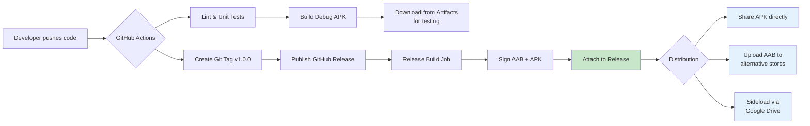

### 17.7 Cost Breakdown (GitHub Free)

| Item                 | Limit                                 | Estimated Usage                               | Cost |
| -------------------- | ------------------------------------- | --------------------------------------------- | ---- |
| **Actions minutes**  | 500 min (private) / 2000 min (public) | ~150 min/month                                | $0   |
| **Artifact storage** | 500 MB                                | ~50 MB per build (auto-deleted after 90 days) | $0   |
| **Concurrent jobs**  | 20                                    | 3–4 parallel jobs                             | $0   |
| **Repository**       | Unlimited collaborators (public)      | -                                             | $0   |

### 17.8 Pre-requisites

Before enabling the pipeline:

1. **Create Keystore**: Generate a release keystore (`keytool` command in §17.3)
2. **Configure Gradle signing**: Add `signingConfigs.release` in `app/build.gradle.kts`
3. **Set GitHub Secrets**: Add `KEYSTORE_BASE64`, `KEYSTORE_PASSWORD`, `KEY_ALIAS`, `KEY_PASSWORD`
4. **Enable Actions**: In repo Settings -> Actions -> Allow all actions
5. **Push workflow file**: Commit `.github/workflows/build.yml`

**Gradle signing config for reference:**

```kotlin
// app/build.gradle.kts
android {
    signingConfigs {
        create("release") {
            storeFile = file("release.keystore")
            storePassword = System.getenv("KEYSTORE_PASSWORD") ?: ""
            keyAlias = System.getenv("KEY_ALIAS") ?: ""
            keyPassword = System.getenv("KEY_PASSWORD") ?: ""
        }
    }

    buildTypes {
        release {
            signingConfig = signingConfigs.getByName("release")
            isMinifyEnabled = true
            proguardFiles(
                getDefaultProguardFile("proguard-android-optimize.txt"),
                "proguard-rules.pro"
            )
        }
    }
}
```

## 18. ProGuard/R8 Rules

### 18.1 Why Custom Rules Are Needed

Release builds use R8 for code shrinking, obfuscation, and optimization. Without explicit keep rules, the following components break:

| Component                           | Issue                                                 | Consequence                       |
| ----------------------------------- | ----------------------------------------------------- | --------------------------------- |
| **Room**                            | DAO methods are used by generated code via reflection | `NullPointerException` at runtime |
| **Hilt**                            | Dagger-generated components use reflection            | `RuntimeException` on injection   |
| **Kotlin Coroutines**               | Continuation classes are obfuscated                   | Suspension points break           |
| **Kotlin Serialization/Reflection** | Data classes renamed                                  | JSON parsing fails                |
| **Compose**                         | `@Stable` / `@Immutable` annotations stripped         | Recomposition issues              |
| **Timber**                          | Tree implementations obfuscated                       | Log output lost                   |

### 18.2 proguard-rules.pro

```pro
# ---- Room ----
-keep class * extends androidx.room.RoomDatabase
-keep @androidx.room.Entity class *
-keep @androidx.room.Dao interface *
-dontwarn androidx.room.paging.**

# Keep generated DAO implementations
-keep class * implements androidx.room.RoomDatabase$Callback { *; }

# ---- Hilt / Dagger ----
-keep class dagger.hilt.** { *; }
-keep class javax.inject.** { *; }
-keep class * extends dagger.hilt.android.internal.managers.ViewComponentManager$FragmentContextWrapper { *; }

# Keep Hilt-generated components
-keep class * extends dagger.hilt.android.components.** { *; }
-keep class * extends dagger.hilt.internal.GeneratedComponent { *; }

# ---- Kotlin Coroutines ----
-keepnames class kotlinx.coroutines.internal.MainDispatcherFactory {}
-keepnames class kotlinx.coroutines.CoroutineExceptionHandler {}
-keepclassmembers class kotlinx.coroutines.** {
    volatile <fields>;
}

# ---- Kotlin Reflect (minimal) ----
-keepclassmembernames class kotlinx.** { volatile <fields>; }

# ---- Room Enums / TypeConverters ----
-keepclassmembers enum com.smsexpense.core.database.entity.** { *; }
-keep class * implements androidx.room.TypeConverter { *; }

# ---- Domain Models (data classes used in Flow/StateFlow) ----
-keep class com.smsexpense.domain.model.** { *; }

# ---- Parser Engine (loaded via reflection from rule store) ----
-keep class com.smsexpense.data.parser.** { *; }

# ---- Compose ----
-keep class androidx.compose.runtime.** { *; }
-keep class * implements androidx.compose.runtime.Stable { *; }
-keep class * implements androidx.compose.runtime.Immutable { *; }

# ---- Timber ----
-keep class timber.log.Timber$Tree { *; }
-keep class * extends timber.log.Timber$Tree { *; }

# ---- Vico Charts ----
-keep class com.patrykandpatrick.vico.** { *; }
-dontwarn com.patrykandpatrick.vico.**

# ---- Gson / Moshi (if added later) ----
-dontwarn com.google.gson.**
-dontwarn com.squareup.moshi.**

# ---- General ----
-keepattributes *Annotation*
-keepattributes SourceFile,LineNumberTable
-keepattributes Signature
-keepattributes Exceptions

# Keep all enum classes (obfuscation breaks `name()` and `ordinal()`)
-keepclassmembers enum * {
    public static **[] values();
    public static ** valueOf(java.lang.String);
}
```

### 18.3 Testing Release Build

Before every release tagged build:

```bash
# Build release to verify rules
./gradlew assembleRelease

# Run lint check for missing keep rules
./gradlew lintRelease

# Quick smoke test on device/emulator
adb install -r app/build/outputs/apk/release/app-release.apk
```

> If the release crashes with `ClassNotFoundException` or `MethodNotFoundException`, add the missing `-keep` rule and rebuild.

---

## 19. Room TypeConverters & Migrations

### 19.1 TypeConverters

Room stores primitive types only. Enums and complex types need `@TypeConverter`:

```kotlin
// TransactionType.kt
enum class TransactionType {
    CREDIT, DEBIT, REFUND, REVERSAL, WALLET_LOAD, E_MANDATE, TRANSFER
}

// Channel.kt
enum class Channel {
    UPI, CARD, ECOM, ATM, NEFT, RTGS, IMPS, NET_BANKING, MANDATE, WALLET, UNKNOWN
}

// ParseMethod.kt
enum class ParseMethod {
    REGEX, MANUAL
}
```

```kotlin
// Converters.kt
class Converters {
    @TypeConverter
    fun fromTransactionType(value: TransactionType): String = value.name

    @TypeConverter
    fun toTransactionType(value: String): TransactionType =
        TransactionType.valueOf(value)

    @TypeConverter
    fun fromChannel(value: Channel): String = value.name

    @TypeConverter
    fun toChannel(value: String): Channel =
        try { Channel.valueOf(value) } catch (_: IllegalArgumentException) { Channel.UNKNOWN }

    @TypeConverter
    fun fromParseMethod(value: ParseMethod): String = value.name

    @TypeConverter
    fun toParseMethod(value: String): ParseMethod = ParseMethod.valueOf(value)

    @TypeConverter
    fun fromLocalDateTime(value: LocalDateTime?): Long? =
        value?.toEpochSecond(ZoneOffset.UTC)

    @TypeConverter
    fun toLocalDateTime(value: Long?): LocalDateTime? =
        value?.let { LocalDateTime.ofEpochSecond(it, 0, ZoneOffset.UTC) }

    @TypeConverter
    fun fromBigDecimal(value: BigDecimal?): String? = value?.toString()

    @TypeConverter
    fun toBigDecimal(value: String?): BigDecimal? =
        value?.let { BigDecimal(it) }
}
```

```kotlin
// SmsExpenseDatabase.kt — register converters
@Database(
    entities = [BankEntity::class, SmsRuleEntity::class, TransactionEntity::class,
                CategoryEntity::class, TransactionLabelEntity::class,
                UserCategoryRuleEntity::class, ParseLogEntity::class, SyncMetaEntity::class],
    version = 1,
    exportSchema = true
)
@TypeConverters(Converters::class)
abstract class SmsExpenseDatabase : RoomDatabase() {
    abstract fun bankDao(): BankDao
    abstract fun smsRuleDao(): SmsRuleDao
    abstract fun transactionDao(): TransactionDao
    abstract fun categoryDao(): CategoryDao
    abstract fun parseLogDao(): ParseLogDao
    abstract fun syncMetaDao(): SyncMetaDao
}
```

### 19.2 Schema Export & Migration Strategy

**Schema export** (enabled via `exportSchema = true`):

```kotlin
// app/build.gradle.kts
ksp {
    arg("room.schemaLocation", "$projectDir/schemas")
}
```

This generates JSON schema files at `app/schemas/com.smsexpense.core.database.SmsExpenseDatabase/1.json`.

**Migration strategy:**

| Scenario                       | Approach                                                      |
| ------------------------------ | ------------------------------------------------------------- |
| New column (nullable)          | `AutoMigration` with `@AutoMigration` annotation              |
| New column (non-null, default) | `AutoMigration` + `Migration.defaultValue()`                  |
| Rename column                  | Manual `Migration(1, 2)` with `ALTER TABLE ... RENAME COLUMN` |
| New table                      | AutoMigration (Room detects new entity)                       |
| Drop column                    | Manual migration (create temp table, copy, drop old, rename)  |
| Complex transformation         | Manual `Migration` with `ALTER TABLE ...` + `UPDATE ...`      |

```kotlin
// Example: Adding smsRuleId FK to TRANSACTION table (v1 -> v2)
val MIGRATION_1_2 = object : Migration(1, 2) {
    override fun migrate(db: SupportSQLiteDatabase) {
        db.execSQL("ALTER TABLE TRANSACTION ADD COLUMN smsRuleId INTEGER REFERENCES SMS_RULE(id)")
        db.execSQL("ALTER TABLE TRANSACTION ADD COLUMN parseMethod TEXT NOT NULL DEFAULT 'regex'")
    }
}

// Database build with migrations
Room.databaseBuilder(context, SmsExpenseDatabase::class.java, "sms_expense.db")
    .addMigrations(MIGRATION_1_2)
    .fallbackToDestructiveMigration() // For dev builds only
    .build()
```

### 19.3 Migration Testing

```kotlin
// MigrationTest.kt (androidTest)
@RunWith(AndroidJUnit4::class)
class MigrationTest {

    // Create database at version 1
    // Insert sample data
    // Run migration to version 2
    // Assert data integrity
    // Assert new columns exist

}
```

---

## 20. Pre-populated Data (Banks & Categories)

### 20.1 Bank Seed Data

The app ships with pre-configured banks stored in `app/src/main/assets/databases/` via Room's `createFromAsset()` or a `RoomDatabase.Callback`.

```kotlin
// Pre-populated via RoomDatabase.Callback
class SeedDatabaseCallback : Callback() {
    override fun onCreate(db: SupportSQLiteDatabase) {
        db.execSQL("""
            INSERT INTO BANK (id, name, code, senderPattern, logoUrl, isActive, createdAt)
            VALUES
            (1, 'HDFC Bank', 'HDFC', '(HDFCBK)', 'hdfc.png', 1, datetime('now')),
            (2, 'ICICI Bank', 'ICICI', '(ICICIT)', 'icici.png', 1, datetime('now')),
            (3, 'State Bank of India', 'SBI', '^(SBI)', 'sbi.png', 1, datetime('now')),
            (4, 'Axis Bank', 'AXIS', '(AXIS)', 'axis.png', 1, datetime('now')),
            (5, 'Kotak Mahindra', 'KOTAK', '(KOTAK)', 'kotak.png', 1, datetime('now')),
            (6, 'Yes Bank', 'YES', '^(YES)', 'yes.png', 1, datetime('now')),
            (7, 'DCB Bank', 'DCB', '(DCBANK)', 'dcb.png', 1, datetime('now')),
            (8, 'IDFC First Bank', 'IDFC', '^(IDFC)', 'idfc.png', 1, datetime('now')),
            (9, 'IndusInd Bank', 'INDUS', '^(INDUS)', 'indus.png', 1, datetime('now')),
            (10, 'Punjab National Bank', 'PNB', '^(PNB)', 'pnb.png', 1, datetime('now')),
            (11, 'Bank of Baroda', 'BOB', '^(BOB)', 'bob.png', 1, datetime('now')),
            (12, 'Pluxee (Sodexo)', 'PLUXEE', '(Pluxee)', 'pluxee.png', 1, datetime('now'))
        """)
    }
}
```

### 20.2 Default Categories

```kotlin
// Pre-populated categories
INSERT INTO CATEGORY (id, name, icon, color, isDefault, displayOrder) VALUES
(1, 'Food & Dining', '🍕', '#FF5722', 1, 1),
(2, 'Groceries', '🛒', '#4CAF50', 1, 2),
(3, 'Fuel & Transport', '⛽', '#FF9800', 1, 3),
(4, 'Bills & Utilities', '📱', '#03A9F4', 1, 4),
(5, 'Shopping', '🛍️', '#E91E63', 1, 5),
(6, 'Entertainment', '🎬', '#9C27B0', 1, 6),
(7, 'Healthcare', '🏥', '#00BCD4', 1, 7),
(8, 'Education', '📚', '#3F51B5', 1, 8),
(9, 'Travel', '✈️', '#FFEB3B', 1, 9),
(10, 'Rent & Housing', '🏠', '#795548', 1, 10),
(11, 'Salary & Income', '💰', '#4CAF50', 1, 11),
(12, 'Investments', '📈', '#2196F3', 1, 12),
(13, 'Transfer', '🔄', '#607D8B', 1, 13),
(14, 'Uncategorized', '❓', '#9E9E9E', 0, 99)
```

### 20.3 Default SMS Rule Seeds

For each bank, 2–5 seed `SMS_RULE` entries are provided (matching the patterns documented in Section 8). Users can edit, disable, or delete these.

```kotlin
INSERT INTO SMS_RULE (id, bankId, ruleName, contentRegex, amountGroup, typeGroup, ...) VALUES
(1, 1, 'HDFC CC Merchant Debit', 'Spent Rs\\.(\\d+[\.,]\\d+).*?Card (\\d{4}).*?At (.*?) On (\\d{4}-\\d{2}-\\d{2}:\\d{2}:\\d{2}:\\d{2})', 'amount', null, ...),
-- 30+ more seed rules for all banks
```

### 20.4 Loading Strategy

```
┌──────────────────────────────────────────────────┐
│                   App Startup                      │
├──────────────────────────────────────────────────┤
│ RoomDatabase.Callback.onCreate()                   │
│   -> INSERT bank seed data                          │
│   -> INSERT category seed data                      │
│   -> INSERT sms_rule seed data                      │
│                                                    │
│ On first launch (detected via SharedPreferences):   │
│   -> Show onboarding -> start SMS sync               │
│                                                    │
│ On subsequent launches:                            │
│   -> Load from existing Room database               │
│   -> Check for seed updates (future schema bump)    │
└──────────────────────────────────────────────────┘
```

---

## 21. Coroutine & Dispatcher Strategy

### 21.1 Dispatcher Bindings

```kotlin
// DispatcherModule.kt — Hilt module for coroutine dispatchers
@Module
@InstallIn(SingletonComponent::class)
object DispatcherModule {

    @IoDispatcher
    @Provides
    @Singleton
    fun provideIoDispatcher(): CoroutineDispatcher = Dispatchers.IO

    @DefaultDispatcher
    @Provides
    @Singleton
    fun provideDefaultDispatcher(): CoroutineDispatcher = Dispatchers.Default

    @MainDispatcher
    @Provides
    @Singleton
    fun provideMainDispatcher(): CoroutineDispatcher = Dispatchers.Main
}
```

```kotlin
// Qualifier annotations
@Retention(AnnotationRetention.BINARY)
@Qualifier
annotation class IoDispatcher

@Retention(AnnotationRetention.BINARY)
@Qualifier
annotation class DefaultDispatcher

@Retention(AnnotationRetention.BINARY)
@Qualifier
annotation class MainDispatcher
```

### 21.2 Dispatcher Usage Strategy

| Operation                   | Dispatcher            | Rationale                      |
| --------------------------- | --------------------- | ------------------------------ |
| Room database queries (DAO) | `Dispatchers.IO`      | I/O-bound, SQLite operations   |
| SMS ContentProvider queries | `Dispatchers.IO`      | Content resolver I/O           |
| Regex parsing               | `Dispatchers.Default` | CPU-bound regex evaluation     |
| File logging                | `Dispatchers.IO`      | File write I/O                 |
| State emission (StateFlow)  | `Dispatchers.Main`    | UI observation must be on main |
| Category inference          | `Dispatchers.Default` | CPU-bound keyword matching     |
| CSV export/import           | `Dispatchers.IO`      | File I/O                       |

### 21.3 Injection Pattern

```kotlin
class ParseSmsUseCase @Inject constructor(
    private val smsRepository: SmsRepository,
    private val parserEngine: ParserEngine,
    @IoDispatcher private val ioDispatcher: CoroutineDispatcher,
    @DefaultDispatcher private val defaultDispatcher: CoroutineDispatcher
) {
    suspend operator fun invoke(smsList: List<SmsMessage>): List<ParsedTransaction> =
        withContext(ioDispatcher) {
            val rules = smsRepository.loadActiveRules()
            withContext(defaultDispatcher) {
                smsList.map { parserEngine.parse(it, rules) }
            }
        }
}
```

### 21.4 Test Pattern

```kotlin
// CoroutineRule.kt
@OptIn(ExperimentalCoroutinesApi::class)
class CoroutineRule : TestWatcher() {
    val testDispatcher = StandardTestDispatcher()

    override fun starting(description: Description) {
        Dispatchers.setMain(testDispatcher)
    }

    override fun finished(description: Description) {
        Dispatchers.resetMain()
    }
}

// Usage in tests
@get:Rule
val coroutineRule = CoroutineRule()

@Test
fun `parse SMS returns correct amount`() = coroutineRule.testDispatcher.runTest {
    // ...
}
```

---

## 22. Debounce & Batching Strategy

### 22.1 Problem Statement

When the user first grants SMS permission and triggers sync, the SMS ContentProvider may return **hundreds or thousands of messages** in rapid succession. Processing each one individually causes:

- Excessive Room transaction overhead
- UI recomposition on every insert
- High CPU usage from repeated regex evaluation

### 22.2 Batch Processing Pipeline

```
SMS Batch (500 messages) -> Channel<Chunk> -> Chunk 1 (100) -> Parse -> Room insert (batch)
                                                    Chunk 2 (100) -> Parse -> Room insert (batch)
                                                    Chunk 3 (100) -> Parse -> Room insert (batch)
                                                    ...
                                       Flow.collect -> Emit UiState(progress) -> UI recomposes once per chunk
```

### 22.3 Implementation

```kotlin
class SmsSyncUseCase @Inject constructor(
    private val smsReader: SmsReader,
    private val parserEngine: ParserEngine,
    private val transactionRepository: TransactionRepository
) {
    companion object {
        private const val CHUNK_SIZE = 100
        private const val DEBOUNCE_MS = 300L
    }

    suspend fun syncInBackground(
        range: SyncRange,
        onProgress: (SyncProgress) -> Unit
    ) {
        val totalCount = smsReader.countSms(range)

        smsReader.readSms(range)       // Returns Flow<List<SmsMessage>>
            .debounce(DEBOUNCE_MS)     // Wait 300ms for more SMS
            .flatMapConcat { list ->
                // Chunking
                flow {
                    list.chunked(CHUNK_SIZE).forEach { chunk ->
                        val parsed = parserEngine.parseBatch(chunk)
                        transactionRepository.insertBatch(parsed)
                        emit(parsed.size)
                    }
                }
            }
            .collect { chunkSize ->
                // Update progress
                onProgress(SyncProgress(
                    processed = processedCount,
                    total = totalCount,
                    chunkProcessed = chunkSize
                ))
            }
    }
}
```

### 22.4 Room Batch Insert

```kotlin
@Dao
interface TransactionDao {
    @Insert(onConflict = OnConflictStrategy.IGNORE)
    suspend fun insertBatch(transactions: List<TransactionEntity>)

    @Query("DELETE FROM TRANSACTION WHERE id IN " +
           "(SELECT id FROM TRANSACTION WHERE smsBodyHash IN " +
           "(SELECT smsBodyHash FROM TRANSACTION GROUP BY smsBodyHash HAVING COUNT(*) > 1))")
    suspend fun deduplicate()
}
```

Deduplication is performed by hashing the raw SMS body (`smsBodyHash` column with `SHA-256` on insert). Existing hashes trigger `IGNORE`.

### 22.5 Why Debounce + Chunk

| Concern      | Without Batching                                   | With Batching               |
| ------------ | -------------------------------------------------- | --------------------------- |
| Room inserts | 1000 individual transactions                       | 10 batch inserts (100 each) |
| UI updates   | 1000 recompositions                                | ~10 recompositions          |
| Memory       | All 1000 in memory at once                         | 100 per chunk               |
| CPU          | Regex called 1000× in parallel (thread contention) | 100× per chunk, sequential  |
| Time         | ~30s for 1000 SMS (unoptimized)                    | ~5s for 1000 SMS (batched)  |

---

## 23. Hilt Module Structure

### 23.1 Module Overview

```
com.smsexpense/
├── di/
│   ├── DispatcherModule.kt       -> @IoDispatcher, @DefaultDispatcher, @MainDispatcher
│   ├── DatabaseModule.kt         -> SmsExpenseDatabase, DAOs
│   ├── ParserModule.kt           -> ParserEngine, RegexProvider
│   ├── SmsReaderModule.kt       -> SmsReader, PermissionManager
│   └── LoggerModule.kt          -> FileLogger, Timber.Tree
```

### 23.2 DatabaseModule

```kotlin
@Module
@InstallIn(SingletonComponent::class)
object DatabaseModule {

    @Provides
    @Singleton
    fun provideDatabase(@ApplicationContext context: Context): SmsExpenseDatabase =
        Room.databaseBuilder(
            context,
            SmsExpenseDatabase::class.java,
            "sms_expense.db"
        ).addCallback(SeedDatabaseCallback())
         .build()

    @Provides fun provideBankDao(db: SmsExpenseDatabase): BankDao = db.bankDao()
    @Provides fun provideSmsRuleDao(db: SmsExpenseDatabase): SmsRuleDao = db.smsRuleDao()
    @Provides fun provideTransactionDao(db: SmsExpenseDatabase): TransactionDao = db.transactionDao()
    @Provides fun provideCategoryDao(db: SmsExpenseDatabase): CategoryDao = db.categoryDao()
    @Provides fun provideParseLogDao(db: SmsExpenseDatabase): ParseLogDao = db.parseLogDao()
    @Provides fun provideSyncMetaDao(db: SmsExpenseDatabase): SyncMetaDao = db.syncMetaDao()
}
```

### 23.3 ParserModule

```kotlin
@Module
@InstallIn(SingletonComponent::class)
object ParserModule {

    @Provides
    @Singleton
    fun provideParserEngine(
        @DefaultDispatcher dispatcher: CoroutineDispatcher
    ): ParserEngine = ParserEngine(dispatcher)
}
```

### 23.4 SmsReaderModule

```kotlin
@Module
@InstallIn(SingletonComponent::class)
object SmsReaderModule {

    @Provides
    @Singleton
    fun providePermissionManager(
        @ApplicationContext context: Context
    ): PermissionManager = PermissionManager(context)

    @Provides
    @Singleton
    fun provideSmsReader(
        @ApplicationContext context: Context
    ): SmsReader = SmsReader(context)
}
```

### 23.5 LoggerModule

```kotlin
@Module
@InstallIn(SingletonComponent::class)
object LoggerModule {

    @Provides
    @Singleton
    fun provideFileLogger(
        @ApplicationContext context: Context
    ): FileLogger = FileLogger(context.filesDir)

    @Provides
    @Singleton
    fun provideTimberTree(fileLogger: FileLogger): Timber.Tree = FileLoggingTree(fileLogger)
}
```

### 23.6 Module Dependency Flow

```
Application
    └─ SingletonComponent
        ├─ @Singleton DatabaseModule -> SmsExpenseDatabase
        │                                   ├─ BankDao
        │                                   ├─ SmsRuleDao
        │                                   ├─ TransactionDao
        │                                   └─ ...
        ├─ @Singleton ParserModule -> ParserEngine
        ├─ @Singleton SmsReaderModule
        │               ├─ PermissionManager
        │               └─ SmsReader
        └─ @Singleton LoggerModule
                        ├─ FileLogger
                        └─ Timber.Tree
```

---

## 24. Empty States

### 24.1 Empty State Design Principles

Every screen displays a meaningful empty state on first launch (zero data) rather than a blank white screen. Empty states include:

- An icon or illustration (Material 3 empty state icon)
- A short, friendly message
- A call-to-action button (if applicable)

### 24.2 Dashboard — Empty State

```
┌─────────────────────────────────────────┐
│                                         │
│            📊 (Material icon)            │
│                                         │
│       No transactions yet                │
│                                         │
│   Sync your SMS to start tracking        │
│   your expenses and income.              │
│                                         │
│   ┌─────────────────────────────────┐   │
│   │    Sync SMS Now                 │   │
│   └─────────────────────────────────┘   │
│                                         │
│   [Import from backup]  [Manual Entry]  │
│                                         │
└─────────────────────────────────────────┘
```

### 24.3 Transaction List — Empty State

```
┌─────────────────────────────────────────┐
│  🔍 Search transactions...              │
│  [All] [Credit] [Debit] [▼ Filter]     │
├─────────────────────────────────────────┤
│                                         │
│           📭 (icon)                     │
│     No transactions found                │
│     Try adjusting your filters or        │
│     sync more SMS.                      │
│                                         │
│   ┌─────────────────────────────────┐   │
│   │    Sync More SMS               │   │
│   └─────────────────────────────────┘   │
│                                         │
└─────────────────────────────────────────┘
```

### 24.4 Category Breakdown — Empty State

```
┌─────────────────────────────────────────┐
│                                         │
│          🏷️ (icon)                     │
│     No categories assigned               │
│                                         │
│   Label transactions to see your         │
│   spending breakdown by category.        │
│                                         │
│   ┌─────────────────────────────────┐   │
│   │    Go to Transactions           │   │
│   └─────────────────────────────────┘   │
│                                         │
└─────────────────────────────────────────┘
```

### 24.5 Parser Test — Empty State

```
┌─────────────────────────────────────────┐
│                                         │
│          🧪 (icon)                     │
│     Test SMS Parsing                    │
│                                         │
│   Paste an SMS message below to see      │
│   how the parser extracts data.          │
│                                         │
│   ┌─────────────────────────────────┐   │
│   │  [Paste SMS text here...]       │   │
│   └─────────────────────────────────┘   │
│   ┌─────────────────────────────────┐   │
│   │    Test Parse                   │   │
│   └─────────────────────────────────┘   │
│                                         │
└─────────────────────────────────────────┘
```

### 24.6 Implementation Pattern

```kotlin
@Composable
fun EmptyState(
    icon: ImageVector = Icons.Outlined.Inbox,
    title: String,
    subtitle: String,
    actionLabel: String? = null,
    onAction: (() -> Unit)? = null
) {
    Column(
        modifier = Modifier.fillMaxSize().padding(32.dp),
        horizontalAlignment = Alignment.CenterHorizontally,
        verticalArrangement = Arrangement.Center
    ) {
        Icon(icon, null, modifier = Modifier.size(96.dp), tint = MaterialTheme.colorScheme.onSurfaceVariant.copy(alpha = 0.4f))
        Spacer(Modifier.height(16.dp))
        Text(title, style = MaterialTheme.typography.titleMedium, color = MaterialTheme.colorScheme.onSurface)
        Spacer(Modifier.height(8.dp))
        Text(subtitle, style = MaterialTheme.typography.bodyMedium, color = MaterialTheme.colorScheme.onSurfaceVariant)
        if (actionLabel != null && onAction != null) {
            Spacer(Modifier.height(24.dp))
            Button(onClick = onAction) { Text(actionLabel) }
        }
    }
}
```

---

## 25. Manual Transaction Entry

### 25.1 Trigger Points

Manual entry is available from:

1. Dashboard empty state -> "Manual Entry" link
2. Transaction list -> FAB (+) button
3. Parser test -> "Add as Transaction" button after manual paste + parse
4. Unparsed SMS -> "Add manually" action on the item

### 25.2 Entry Screen Layout

```
┌─────────────────────────────────────────┐
│  ✕ [Manual Entry]                    ✓ │
├─────────────────────────────────────────┤
│                                         │
│  Amount *                               │
│  ┌─────────────────────────────────┐   │
│  │  ₹  |_______|                   │   │
│  └─────────────────────────────────┘   │
│                                         │
│  Type *                                 │
│  ○ Credit    ● Debit                    │
│                                         │
│  Date *                                 │
│  ┌─────────────────────────────────┐   │
│  │  15 Jul 2026            📅     │   │
│  └─────────────────────────────────┘   │
│                                         │
│  Account (optional)                     │
│  ┌─────────────────────────────────┐   │
│  │  XX1111                        │   │
│  └─────────────────────────────────┘   │
│                                         │
│  Payee / Merchant (optional)            │
│  ┌─────────────────────────────────┐   │
│  │  Swiggy                        │   │
│  └─────────────────────────────────┘   │
│                                         │
│  Category                               │
│  ┌─────────────────────────────────┐   │
│  │  Food & Dining           ▼     │   │
│  └─────────────────────────────────┘   │
│                                         │
│  Reference ID (optional)                │
│  ┌─────────────────────────────────┐   │
│  │  Ref12345                      │   │
│  └─────────────────────────────────┘   │
│                                         │
│  ┌─────────────────────────────────┐   │
│  │     Save Transaction            │   │
│  └─────────────────────────────────┘   │
│                                         │
└─────────────────────────────────────────┘
```

### 25.3 Validation Rules

| Field     | Rule                                       |
| --------- | ------------------------------------------ |
| Amount    | Required, must be > 0, decimal (2 digits)  |
| Type      | Required, radio (Credit / Debit)           |
| Date      | Required, defaults to today, date picker   |
| Account   | Optional, max 30 chars                     |
| Payee     | Optional, max 100 chars                    |
| Category  | Optional dropdown (default: Uncategorized) |
| Reference | Optional, max 50 chars                     |

### 25.4 State Flow

```
User taps (+) FAB
    -> ManualEntryScreen opens (BottomSheet or full screen)
    -> User fills fields
    -> User taps "Save"
    -> ViewModel validates input
    -> If invalid -> show inline errors
    -> If valid -> insert TransactionEntity with parseMethod = MANUAL
    -> Close sheet
    -> Transaction list updates via Flow
```

---

## 26. Error States in UI

### 26.1 Error Type Matrix

| Error                                 | Source            | UI Treatment                          | User Action             |
| ------------------------------------- | ----------------- | ------------------------------------- | ----------------------- |
| SMS permission denied                 | PermissionManager | Banner at top of dashboard            | "Open Settings" button  |
| Sync failed (unknown)                 | SmsSyncUseCase    | Snackbar "Sync failed" + retry        | Tap retry               |
| Sync partially failed (N/1000 failed) | SmsSyncUseCase    | Snackbar "N messages failed to parse" | Tap to view failed list |
| Parser regex error                    | ParserEngine      | Red error badge on Parser Test screen | Edit regex              |
| Room insert failure                   | TransactionDao    | Silent (logged to FileLogger)         | —                       |
| Coroutine cancellation                | ViewModel         | Silent (expected lifecycle behavior)  | —                       |
| CSV export failed                     | BackupManager     | Dialog "Export failed: reason"        | Try again               |
| Category save failed                  | CategoryDao       | Snackbar "Could not save category"    | Try again               |

### 26.2 Error UI Components

**Error Banner (persistent):**

```
┌─────────────────────────────────────────────┐
│ ⚠️ SMS permission is required to read        │
│    transactions.                            │
│ [Open Settings] [Dismiss]                   │
└─────────────────────────────────────────────┘
```

**Snackbar (transient):**

```
┌─────────────────────────────────────┐
│ Sync failed. [Retry] ✕             │
└─────────────────────────────────────┘
```

**Inline form error:**

```
  Amount
  ┌─────────────────────────────────┐
  │  | -50                         │  ← red border
  └─────────────────────────────────┘
  ⚠ Amount must be greater than 0
```

**Error dialog (blocking):**

```
┌─────────────────────────────────────┐
│  ❌ Export Failed                    │
│                                     │
│  Could not write CSV file.          │
│  Check device storage space.        │
│                                     │
│           [OK]                      │
└─────────────────────────────────────┘
```

### 26.3 Error State ViewModel Pattern

```kotlin
// Sealed class for screen-level errors
sealed interface UiError {
    data class Snackbar(val message: String, val actionLabel: String? = null, val action: (() -> Unit)? = null) : UiError
    data class Banner(val message: String, val actionLabel: String, val action: () -> Unit) : UiError
    data class Dialog(val title: String, val message: String) : UiError
    data object Dismissed : UiError
}

data class DashboardUiState(
    val transactions: List<Transaction> = emptyList(),
    val isLoading: Boolean = true,
    val error: UiError = UiError.Dismissed,
    val isPermissionGranted: Boolean = false,
    val syncProgress: SyncProgress? = null
)

// In ViewModel
private val _uiState = MutableStateFlow(DashboardUiState())
val uiState: StateFlow<DashboardUiState> = _uiState.asStateFlow()

fun loadTransactions() {
    viewModelScope.launch {
        _uiState.update { it.copy(isLoading = true) }
        getTransactionsUseCase()
            .catch { e ->
                _uiState.update {
                    it.copy(
                        isLoading = false,
                        error = UiError.Snackbar(
                            message = "Could not load transactions",
                            actionLabel = "Retry",
                            action = ::loadTransactions
                        )
                    )
                }
            }
            .collect { transactions ->
                _uiState.update { it.copy(transactions = transactions, isLoading = false) }
            }
    }
}
```

### 26.4 Consuming Errors in Compose

```kotlin
@Composable
fun DashboardScreen(viewModel: DashboardViewModel = hiltViewModel()) {
    val uiState by viewModel.uiState.collectAsStateWithLifecycle()
    val snackbarHostState = remember { SnackbarHostState() }

    LaunchedEffect(uiState.error) {
        when (val error = uiState.error) {
            is UiError.Snackbar -> {
                val result = snackbarHostState.showSnackbar(
                    message = error.message,
                    actionLabel = error.actionLabel
                )
                if (result == SnackbarResult.ActionPerformed) error.action?.invoke()
                viewModel.clearError()
            }
            else -> {}
        }
    }

    Scaffold(snackbarHost = { SnackbarHost(snackbarHostState) }) { padding ->
        // ...
    }
}
```

---

## 27. Risk Mitigation

| Risk                                      | Impact                          | Likelihood | Mitigation                                                                      |
| ----------------------------------------- | ------------------------------- | ---------- | ------------------------------------------------------------------------------- |
| Bank changes SMS format                   | Parser breaks for specific bank | High       | User-extensible regex rules, parser test UI, community rule sharing             |
| Google restricts SMS APIs further         | App functionality lost          | Medium     | Monitor API changes, explore alternative SMS reading methods                    |
| Large SMS inbox causes performance issues | Slow initial load               | Medium     | Paginated loading, background processing, incremental sync                      |
| User has multiple SIM cards               | SMS from different numbers      | Low        | Match sender ID patterns, not phone numbers                                     |
| Regional bank SMS in local language       | Parser can't handle             | Medium     | Focus on English SMS first, add Hindi/regional later via additional regex rules |
| SMS deletion by user                      | Data loss                       | Low        | App stores parsed data independently, syncs on demand                           |
| Complex SMS formats don't match regex     | Unparsed transactions           | Medium     | Parser test UI allows users to create custom rules, manual entry fallback       |

---

## 28. Future Enhancements

### Phase 2 (Post-MVP)

- [ ] **Budget Management**: Set monthly budgets per category, get alerts
- [ ] **Recurring Transaction Detection**: Auto-detect subscriptions, EMIs
- [ ] **Multi-Currency Support**: For international transactions
- [ ] **Google Drive Backup**: Cloud sync via encrypted backups
- [ ] **Widget**: Home screen widget showing today's spending
- [ ] **Notification Listener**: Real-time transaction detection (requires NotificationListener permission)

### Phase 3 (Advanced)

- [ ] **OCR for Receipts**: Camera capture + ML Kit OCR
- [ ] **Shared Expenses**: Split expenses with contacts
- [ ] **Tax Categorization**: Tag transactions for tax purposes (80C, HRA, etc.)
- [ ] **Bank Statement Import**: Parse PDF bank statements
- [ ] **Wear OS Companion**: Quick glance spending on smartwatch

---

## Appendix A: Dependencies

```kotlin
// build.gradle.kts (app)
// Versions should be managed via libs.versions.toml (Version Catalog)

dependencies {
    // Compose BOM
    implementation(platform("androidx.compose:compose-bom:2026.06.01"))
    implementation("androidx.compose.material3:material3")
    implementation("androidx.compose.ui:ui")
    implementation("androidx.compose.ui:ui-tooling-preview")

    // Navigation
    implementation("androidx.navigation:navigation-compose:2.9.0")

    // Room
    implementation("androidx.room:room-runtime:2.8.4")
    implementation("androidx.room:room-ktx:2.8.4")
    ksp("androidx.room:room-compiler:2.8.4")

    // Hilt (Dagger)
    implementation("com.google.dagger:hilt-android:2.60.1")
    ksp("com.google.dagger:hilt-compiler:2.60.1")
    implementation("androidx.hilt:hilt-navigation-compose:1.4.0")

    // Vico Charts
    implementation("com.patrykandpatrick.vico:compose-m3:2.5.2")

    // Timber (logging)
    implementation("com.jakewharton.timber:timber:5.0.1")

    // Coroutines
    implementation("org.jetbrains.kotlinx:kotlinx-coroutines-android:1.9.0")

    // Testing
    testImplementation("junit:junit:4.13.2")
    testImplementation("org.jetbrains.kotlinx:kotlinx-coroutines-test:1.9.0")
    testImplementation("io.mockk:mockk:1.13.13")
    androidTestImplementation("androidx.test.ext:junit:1.2.1")
    androidTestImplementation("androidx.room:room-testing:2.8.4")
    androidTestImplementation("androidx.compose.ui:ui-test-junit4")
}
```

## Appendix B: Permissions Manifest

```xml
<!-- AndroidManifest.xml -->
<uses-permission android:name="android.permission.READ_SMS" />
<uses-permission android:name="android.permission.RECEIVE_SMS" />
<!-- RECEIVE_SMS for real-time transaction detection (future) -->

<application
    android:name=".app.SmsExpenseApp"
    android:allowBackup="true"
    android:icon="@mipmap/ic_launcher"
    android:label="@string/app_name"
    android:theme="@style/Theme.SmsExpenseTracker"
    android:supportsRtl="true">

    <activity
        android:name=".presentation.MainActivity"
        android:exported="true"
        android:windowSoftInputMode="adjustResize">
        <intent-filter>
            <action android:name="android.intent.action.MAIN" />
            <category android:name="android.intent.category.LAUNCHER" />
        </intent-filter>
    </activity>
</application>
```

---

**Document End**

> This solution design document serves as the blueprint for implementing the SMS Expense Tracker app. All technical decisions, architecture patterns, and implementation strategies are documented here for reference during development.
